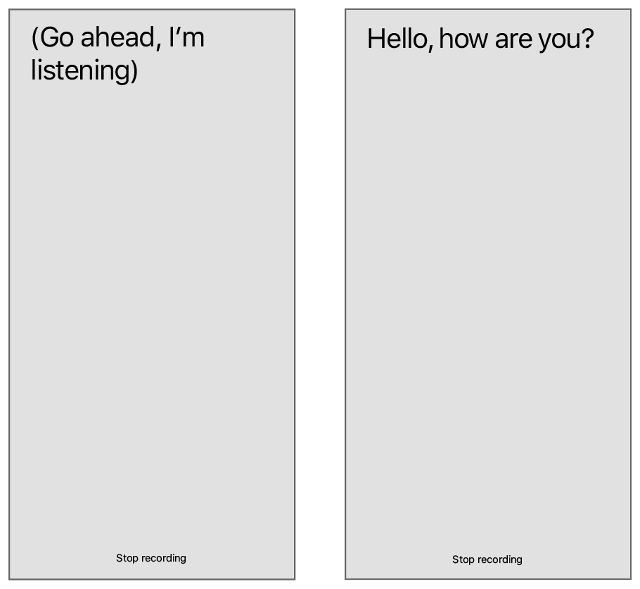

# Recognizing Speech in Live Audio

Perform speech recognition on audio coming from the microphone of an iOS device.

## Overview

This sample project demonstrates how to use the Speech framework to recognize words from captured audio. When you tap the Start Recording button, SpokenWord begins capturing audio from the device’s microphone. It routes that audio to the APIs of the Speech framework, which process the audio and send back any recognized text. The app displays the recognized text in its text view, continuously updating that text until you tap the Stop Recording button.  

 


- Important: Apps must include the `NSSpeechRecognitionUsageDescription` key in their `Info.plist` file and must request authorization to perform speech recognition. For information about requesting authorization, see [Asking Permission to Use Speech Recognition](https://developer.apple.com/documentation/speech/asking_permission_to_use_speech_recognition). 

## Configure the Microphone Using AVFoundation

SpokenWord uses AV Foundation to communicate with the device’s microphone. Specifically, the app configures the shared [AVAudioSession](https://developer.apple.com/documentation/avfoundation/avaudiosession) object to manage the app’s audio interactions with the rest of the system, and it configures an [AVAudioEngine](https://developer.apple.com/documentation/avfoundation/avaudioengine) object to retrieve the microphone input.

``` swift
private let audioEngine = AVAudioEngine()
```

When you tap its Start Recording button, the app retrieves the shared [AVAudioSession](https://developer.apple.com/documentation/avfoundation/avaudiosession) object, configures it for recording, and makes it the active session. Activating the session lets the system know that the app needs the microphone resource. If that resource is unavailable—perhaps because the user is talking on the phone—the [setActive(_:options:)](https://developer.apple.com/documentation/avfoundation/avaudiosession/1616627-setactive) method throws an exception. 

``` swift
// Configure the audio session for the app.
let audioSession = AVAudioSession.sharedInstance()
try audioSession.setCategory(.record, mode: .measurement, options: .duckOthers)
try audioSession.setActive(true, options: .notifyOthersOnDeactivation)
let inputNode = audioEngine.inputNode
```

Once the session is active, the app retrieves the [AVAudioInputNode](https://developer.apple.com/documentation/avfoundation/avaudioinputnode) object from its audio engine and stores it in the local `inputNode` variable. The input node represents the current audio input path, which can be the device’s built-in microphone or a microphone connected to a set of headphones. 

To begin recording, the app installs a tap on the input node and starts up the audio engine, which begins collecting samples into an internal buffer. When a buffer is full, the audio engine calls the provided block. The app’s implementation of that block passes the samples directly to the request object's [append(_:)](https://developer.apple.com/documentation/speech/sfspeechaudiobufferrecognitionrequest/1649389-append) method, which accumulates the audio samples and delivers them to the speech recognition system. 

``` swift
// Configure the microphone input.
let recordingFormat = inputNode.outputFormat(forBus: 0)
inputNode.installTap(onBus: 0, bufferSize: 1024, format: recordingFormat) { (buffer: AVAudioPCMBuffer, when: AVAudioTime) in
    self.recognitionRequest?.append(buffer)
}

audioEngine.prepare()
try audioEngine.start()
```

## Create the Speech Recognition Request

To recognize speech from live audio, SpokenWord creates and configures an [SFSpeechAudioBufferRecognitionRequest](https://developer.apple.com/documentation/speech/sfspeechaudiobufferrecognitionrequest) object. When it receives recognition results, the app updates its text view accordingly. The app sets the request object's [shouldReportPartialResults](https://developer.apple.com/documentation/speech/sfspeechrecognitionrequest/1649392-shouldreportpartialresults) property to `true`, which causes the speech recognition system to return intermediate results as they are recognized. 

``` swift
// Create and configure the speech recognition request.
recognitionRequest = SFSpeechAudioBufferRecognitionRequest()
guard let recognitionRequest = recognitionRequest else { fatalError("Unable to create a SFSpeechAudioBufferRecognitionRequest object") }
recognitionRequest.shouldReportPartialResults = true
```

To begin the speech recognition process, the app calls [recognitionTask(with:resultHandler:)](https://developer.apple.com/documentation/speech/sfspeechrecognizer/1649883-recognitiontask) on its [SFSpeechRecognizer](https://developer.apple.com/documentation/speech/sfspeechrecognizer) object. That method uses the information in the provided request object to configure the speech recognition system and to begin processing audio asynchronously. Shortly after calling it, the app begins appending audio samples to the request object. When you tap the Stop Recording button, the app stops adding samples and ends the speech recognition process.

Because the request's [shouldReportPartialResults](https://developer.apple.com/documentation/speech/sfspeechrecognitionrequest/1649392-shouldreportpartialresults) property is `true`, the [recognitionTask(with:resultHandler:)](https://developer.apple.com/documentation/speech/sfspeechrecognizer/1649883-recognitiontask) method executes its block periodically to deliver partial results. The app uses that block to update its text view with the text in the [bestTranscription](https://developer.apple.com/documentation/speech/sfspeechrecognitionresult/1648280-besttranscription) property of the result object. If it receives an error instead of a result, the app stops the recognition process altogether.  

``` swift
// Create a recognition task for the speech recognition session.
// Keep a reference to the task so that it can be canceled.
recognitionTask = speechRecognizer.recognitionTask(with: recognitionRequest) { result, error in
    var isFinal = false
    
    if let result = result {
        // Update the text view with the results.
        self.textView.text = result.bestTranscription.formattedString
        isFinal = result.isFinal
        print("Text \(result.bestTranscription.formattedString)")
    }
    
    if error != nil || isFinal {
        // Stop recognizing speech if there is a problem.
        self.audioEngine.stop()
        inputNode.removeTap(onBus: 0)

        self.recognitionRequest = nil
        self.recognitionTask = nil

        self.recordButton.isEnabled = true
        self.recordButton.setTitle("Start Recording", for: [])
    }
}
```

## Respond to Availability Changes for Speech Recognition

The availability of speech recognition services can change at any time. For some languages, speech recognition relies on Apple servers, which requires an active Internet connection. If that Internet connection is lost, your app must be ready to handle the disruption of service that can occur. 

Whenever the availability of speech recognition services changes, the [SFSpeechRecognizer](https://developer.apple.com/documentation/speech/sfspeechrecognizer) object notifies its delegate. SpokenWord provides a delegate object and implements the [speechRecognizer(_:availabilityDidChange:)](https://developer.apple.com/documentation/speech/sfspeechrecognizerdelegate/1649879-speechrecognizer) method to respond to availability changes. When services become unavailable, the method disables the Start Recording button and updates its title. When services become available, the method reenables the button and restores its original title.  

``` swift
public func speechRecognizer(_ speechRecognizer: SFSpeechRecognizer, availabilityDidChange available: Bool) {
    if available {
        recordButton.isEnabled = true
        recordButton.setTitle("Start Recording", for: [])
    } else {
        recordButton.isEnabled = false
        recordButton.setTitle("Recognition Not Available", for: .disabled)
    }
}
```
