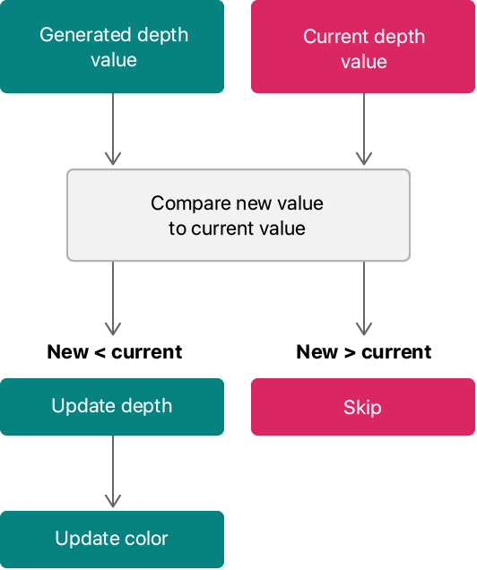

# Calculating Primitive Visibility Using Depth Testing

Determine which pixels are visible in a scene by using a depth texture.

## Overview

When graphics primitives overlap each other, by default, Metal renders them in the order in which you submitted them. This method for determining visibility is referred to as the _painter's algorithm_ because of its similarity to how paint is applied to a surface: The last coat is always the one that you'll see. However, this method is insufficient to render complex 3D scenes.   To determine visibility independently from the submission order, you need to add *hidden-surface removal*. Metal provides depth testing as a way to determine visibility for each fragment as it is rendered.

Depth is a measure of the distance from a viewing position to a specific pixel. When using depth testing, you add a *depth texture* (sometimes called a *depth buffer*) to your render pass. A depth texture stores a depth value for each pixel in the same way that a color texture holds a color value. You determine how depth values are calculated for each fragment, usually by calculating the depth for each vertex and letting the hardware interpolate these depth values. The GPU tests new fragments to see if they are closer to the viewing position than the current value stored in the depth texture. If a fragment is farther away, the GPU discards the fragment. Otherwise, it updates the pixel data, including the new depth value. Because the GPU tests the depth of all fragments, it renders triangles correctly even when the triangles are partially obscured.



This sample demonstrates depth testing by showing a triangle and letting you change the depth value of each of its vertices. The depth of each fragment is interpolated between the depth values you set for the triangle's vertices, and the app configures the GPU to perform the depth test as described above. Each time a render pass is executed, it clears the depth texture's data, then renders a gray square at the halfway point. Finally, the render pass renders the triangle. Only the fragments closer to the viewer than the gray square are visible.

This sample only demonstrates how to use depth testing. It doesn't cover concepts for rendering a 3D scene.

## Create a Depth Texture

By default, `MTKView` doesn't create depth textures. To add them, set the `depthStencilPixelFormat` property to the data format you want to use for depth textures. The view creates and manages them for you automatically.

``` objective-c
mtkView.depthStencilPixelFormat = MTLPixelFormatDepth32Float;
```

This sample uses a 32-bit floating-point depth value for each pixel. Pick a format that has the range and precision you need for your intended use case.

## Specify the Depth Format in the Render Pipeline

To enable depth testing for a render pipeline, set the `depthAttachmentPixelFormat` property on the descriptor when you create the render pipeline, as shown below:

``` objective-c
pipelineStateDescriptor.depthAttachmentPixelFormat = mtkView.depthStencilPixelFormat;
```

As with color formats, the render pipeline needs information about the format of the depth texture so that it can read or write values in the texture. Specify the same depth format that you used to configure your view. When you add a depth texture, Metal enables additional stages on the render pipeline:


## Configure the Depth Test

In Metal, you configure depth testing independently from the render pipeline, so you can mix and match combinations of render pipelines and depth tests. The depth test is represented by a `MTLDepthStencilState` object, and like you do with a render pipeline, you usually create this object when you initialize your app, and keep a reference to it as long as you need to execute that test.

In the flowchart shown in the overview, the depth test passes when a new depth value is smaller than the existing value for the target pixel in the depth texture, indicating that the fragment is closer to the viewer than whatever was previously rendered there. When the depth test passes, the fragment's color values are written to the color render attachments, and the new depth value is written to the depth attachment. This code shows how to configure the depth test:

``` objective-c
MTLDepthStencilDescriptor *depthDescriptor = [MTLDepthStencilDescriptor new];
depthDescriptor.depthCompareFunction = MTLCompareFunctionLessEqual;
depthDescriptor.depthWriteEnabled = YES;
_depthState = [_device newDepthStencilStateWithDescriptor:depthDescriptor];
```

- Note: Metal combines depth testing with a *stencil test*, which performs a similar test using a count stored for each pixel, typically the number of times that fragments pass the depth test. Stencil operations are useful for implementing certain 3D algorithms. By default, the stencil test is disabled, and this sample doesn't enable it.

## Generate Depth Values in Your Shaders

Now that the initialization steps are complete, you can write the vertex shader. In [Rendering](https://developer.apple.com/documentation/metal/using_a_render_pipeline_to_render_primitives), you learned that Metal's Normalized Device Coordinate (NDC) system uses four-dimensional coordinates, and that your vertex shader must provide a position for each vertex. That sample ignored the z coordinate, but to implement the depth test, you need to provide a value for the z coordinate.

In this sample, you configure the z values in the user interface, and those values are passed down to the vertex shader. The shader then takes the z values on the input data and passes them through to the output's z component. 

``` metal
out.clipSpacePosition.z = vertices[vertexID].position.z;
```

When the rasterizer calculates the data to send to the fragment shader, it interpolates between these z values:


Your fragment function can read the z value, ignore it, or modify it, as needed. If you don't modify the value calculated by the rasterizer, a GPU can sometimes perform additional optimizations. For example, it may be able to execute the z test before running the fragment shader, so that it doesn't run the fragment shader for hidden fragments. If you change the depth value in the fragment shader, you may incur a performance penalty because the GPU must execute the fragment shader first.

## Clear the Depth Texture at the Start of the Render Pass

A render pass includes a list of textures that it targets, including (optionally) a depth texture. If you plan to use depth testing, you need to configure the render pass's depth texture attachment.  Because you configured the view to include a depth texture, when you ask the view for a render pass descriptor, it automatically configures the descriptor's depth render target to point at a depth texture. It also configures the render pass to clear the depth texture at the start of the frame. All you need to do is provide the starting depth value for the depth texture.

``` objective-c
mtkView.clearDepth = 1.0;
```

When the GPU starts the render pass, every pixel in the depth texture is initialized to `1.0` .


## Encode a Draw Command

As in other Metal rendering examples, this sample creates a render command encoder and then encodes a series of draw commands. When you configure the arguments for a draw call, you include a reference to the depth test to execute. 
``` objective-c
[renderEncoder setDepthStencilState:_depthState];
```

The rest of the code to set arguments and encode the draw command is similar to what you've already seen in [Rendering](https://developer.apple.com/documentation/metal/using_a_render_pipeline_to_render_primitives).

This sample uses the shader to encode two draw commands. First, it renders a quad across the view with a depth value of `0.5`. Because all of these values are less than the default value, the quad is always drawn into the render targets, and the depth values are always updated. The sample then renders a triangle, using the depth values you've specified in the app's user interface. If you increase the depth values of any of the triangle's vertices beyond `0.5`, parts of the triangle disappear because some of the fragments are "behind" the quad and fail the depth test.

Experiment with the sliders and see how the results change.

