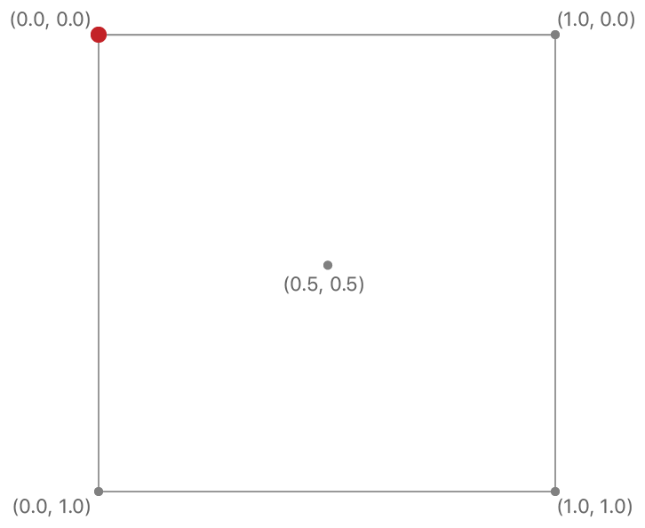

# Creating and Sampling Textures

Load image data into a texture and apply it to a quadrangle.

## Overview

You use textures to draw and process images in Metal.
A texture is a structured collection of texture elements, often called *texels* or *pixels*.
The exact configuration of these texture elements depends on the type of texture.
This sample uses a texture structured as a 2D array of elements, each of which contains color data, to hold an image.
The texture is drawn onto geometric primitives through a process called *texture mapping*. The fragment function generates colors for each fragment by sampling the texture.

Textures are managed by `MTLTexture` objects.
A `MTLTexture` object defines the texture's format, including the size and layout of elements, the number of elements in the texture, and how those elements are organized.
Once created, a texture’s format and organization never change.
However, you can change the contents of the texture, either by rendering to it or copying data into it.

The Metal framework doesn't provide an API to directly load image data from a file to a texture.
Metal itself only allocates texture resources and provides methods that copy data to and from the texture.
Metal apps rely on custom code or other frameworks, like MetalKit, Image I/O, UIKit, or AppKit, to handle image files. For example, you can use [MTKTextureLoader](https://developer.apple.com/documentation/metalkit/mtktextureloader) to perform simple texture loading. This sample shows how to write a custom texture loader.

- Note: The Xcode project contains schemes for running the sample on macOS, iOS, or tvOS devices. The default scheme is macOS, which runs the sample as is on your Mac.


## Load and Format Image Data

You can create a texture or update its contents manually, a process that's covered in the next few sections.
You might do this for multiple reasons:

- You have image data stored in a custom format.
- You have textures whose contents need to be generated at runtime.
- You are streaming texture data from a server or otherwise need to dynamically update a texture's contents.

In the sample, the `AAPLImage` class loads and parses image data from TGA files.
The class converts pixel data from the TGA file into a pixel format that Metal understands.
The sample uses the image's metadata to create a new Metal texture and copies the pixel data into the texture.

- Note: The `AAPLImage` class isn't the focal point of this sample, so it isn't discussed in detail. The class demonstrates basic image loading operations but doesn't use or depend on the Metal framework. Its sole purpose is to facilitate loading image data and converting it into a Metal pixel format. You might create a similar class if you need to load an image that's in a custom format.

Metal requires all textures to be formatted with a specific `MTLPixelFormat` value.
The pixel format describes the layout of pixel data in the texture.
This sample uses the `MTLPixelFormatBGRA8Unorm` pixel format, which uses 32 bits per pixel, arranged into 8 bits per component, in blue, green, red, and alpha order:


Before you can populate a Metal texture, you must format the image data into the texture's pixel format.
TGA files can provide pixel data either in a 32-bit-per-pixel format or a 24-bit-per-pixel format. TGA files that use 32 bits per pixel are already arranged in this format, so you just copy the pixel data.
To convert a 24-bit-per-pixel BGR image, copy the red, green, and blue channels and set the alpha channel to 255, indicating a fully opaque pixel. 

``` objective-c
// Initialize a source pointer with the source image data that's in BGR form
uint8_t *srcImageData = ((uint8_t*)fileData.bytes +
                         sizeof(TGAHeader) +
                         tgaInfo->IDSize);

// Initialize a destination pointer to which you'll store the converted BGRA
// image data
uint8_t *dstImageData = mutableData.mutableBytes;

// For every row of the image
for(NSUInteger y = 0; y < _height; y++)
{
    // If bit 5 of the descriptor is not set, flip vertically
    // to transform the data to Metal's top-left texture origin
    NSUInteger srcRow = (tgaInfo->topOrigin) ? y : _height - 1 - y;

    // For every column of the current row
    for(NSUInteger x = 0; x < _width; x++)
    {
        // If bit 4 of the descriptor is set, flip horizontally
        // to transform the data to Metal's top-left texture origin
        NSUInteger srcColumn = (tgaInfo->rightOrigin) ? _width - 1 - x : x;

        // Calculate the index for the first byte of the pixel you're
        // converting in both the source and destination images
        NSUInteger srcPixelIndex = srcBytesPerPixel * (srcRow * _width + srcColumn);
        NSUInteger dstPixelIndex = 4 * (y * _width + x);

        // Copy BGR channels from the source to the destination
        // Set the alpha channel of the destination pixel to 255
        dstImageData[dstPixelIndex + 0] = srcImageData[srcPixelIndex + 0];
        dstImageData[dstPixelIndex + 1] = srcImageData[srcPixelIndex + 1];
        dstImageData[dstPixelIndex + 2] = srcImageData[srcPixelIndex + 2];

        if(tgaInfo->bitsPerPixel == 32)
        {
            dstImageData[dstPixelIndex + 3] =  srcImageData[srcPixelIndex + 3];
        }
        else
        {
            dstImageData[dstPixelIndex + 3] = 255;
        }
    }
}
_data = mutableData;
```

## Create a Texture from a Texture Descriptor

Use a `MTLTextureDescriptor` object to configure properties like texture dimensions and pixel format for a `MTLTexture` object.
Then call the `newTextureWithDescriptor:` method to create a texture. 

``` objective-c
MTLTextureDescriptor *textureDescriptor = [[MTLTextureDescriptor alloc] init];

// Indicate that each pixel has a blue, green, red, and alpha channel, where each channel is
// an 8-bit unsigned normalized value (i.e. 0 maps to 0.0 and 255 maps to 1.0)
textureDescriptor.pixelFormat = MTLPixelFormatBGRA8Unorm;

// Set the pixel dimensions of the texture
textureDescriptor.width = image.width;
textureDescriptor.height = image.height;

// Create the texture from the device by using the descriptor
id<MTLTexture> texture = [_device newTextureWithDescriptor:textureDescriptor];
```

Metal creates a `MTLTexture` object and allocates memory for the texture data. This memory is uninitialized when the texture is created, so the next step is to copy your data into the texture. 

## Copy the Image Data into the Texture

Metal manages memory for textures and doesn't provide you direct access to it. So you can't get a pointer to the texture data in memory and copy the pixels yourself. Instead, you call methods on a `MTLTexture` object to copy data from memory you can access into the texture and vice versa.

In this sample, the `AAPLImage` object allocated memory for the image data, so you'll tell the texture object to copy this data.

Use a `MTLRegion` structure to identify which part of the texture you want to update.
This sample populates the entire texture with image data; so create a region that covers the entire texture.

``` objective-c
MTLRegion region = {
    { 0, 0, 0 },                   // MTLOrigin
    {image.width, image.height, 1} // MTLSize
};
```

Image data is typically organized in rows, and you need to tell Metal the offset between rows in the source image.
The image loading code creates image data in a *tightly packed* format, so the data of subsequent pixel rows immediately follows the previous row.
Calculate the offset between rows to be the exact length (in bytes) of a row — the number of bytes per pixel multiplied by the image width.

``` objective-c
NSUInteger bytesPerRow = 4 * image.width;
```

Call the `replaceRegion:mipmapLevel:withBytes:bytesPerRow:` method on the texture to copy pixel data from the `AAPLImage` object into the texture.

``` objective-c
[texture replaceRegion:region
            mipmapLevel:0
              withBytes:image.data.bytes
            bytesPerRow:bytesPerRow];
```

## Map the Texture Onto a Geometric Primitive

You can't render a texture on its own; you must map it onto geometric primitives (in this example, a pair of triangles) that are output by the vertex stage and turned into fragments by the rasterizer.
Each fragment needs to know which part of the texture should be applied to it.
You define this mapping with *texture coordinates*: floating-point positions that map locations on a texture image to locations on the geometric surface.

For 2D textures, normalized texture coordinates are values from 0.0 to 1.0 in both x and y directions.
A value of (0.0, 0.0) specifies the texel at the first byte of the texture data (the top-left corner of the image).
A value of (1.0, 1.0) specifies the texel at the last byte of the texture data (the bottom-right corner of the image).



Add a field to the vertex format to hold texture coordinates:

``` objective-c
typedef struct
{
    // Positions in pixel space. A value of 100 indicates 100 pixels from the origin/center.
    vector_float2 position;

    // 2D texture coordinate
    vector_float2 textureCoordinate;
} AAPLVertex;
```

In the vertex data, map the quad's corners to the texture's corners:

``` objective-c
static const AAPLVertex quadVertices[] =
{
    // Pixel positions, Texture coordinates
    { {  250,  -250 },  { 1.f, 1.f } },
    { { -250,  -250 },  { 0.f, 1.f } },
    { { -250,   250 },  { 0.f, 0.f } },

    { {  250,  -250 },  { 1.f, 1.f } },
    { { -250,   250 },  { 0.f, 0.f } },
    { {  250,   250 },  { 1.f, 0.f } },
};
```

To send the texture coordinates to the fragment shader, add a `textureCoordinate` value to the `RasterizerData` data structure:

``` metal
struct RasterizerData
{
    // The [[position]] attribute qualifier of this member indicates this value is
    // the clip space position of the vertex when this structure is returned from
    // the vertex shader
    float4 position [[position]];

    // Since this member does not have a special attribute qualifier, the rasterizer
    // will interpolate its value with values of other vertices making up the triangle
    // and pass that interpolated value to the fragment shader for each fragment in
    // that triangle.
    float2 textureCoordinate;

};
```

In the vertex shader, pass the texture coordinates to the rasterizer stage by writing them into the `textureCoordinate` field.
The rasterizer stage interpolates these coordinates across the quad's triangle fragments.

``` metal
out.textureCoordinate = vertexArray[vertexID].textureCoordinate;
```

## Calculate a Color from a Location in the Texture

You sample a texture to calculate a color from a location in the texture.
To sample the texture data, the fragment function needs the texture coordinates and a reference to the texture to sample. In addition to the arguments passed in from the rasterizer stage, pass in a `colorTexture` argument with a `texture2d` type and the `[[texture(index)]]` attribute qualifier.
This argument is a reference to a `MTLTexture` object to be sampled.

``` metal
fragment float4
samplingShader(RasterizerData in [[stage_in]],
               texture2d<half> colorTexture [[ texture(AAPLTextureIndexBaseColor) ]])
```

Use the built-in texture `sample()` function to sample texel data.
The `sample()` function takes two arguments: a sampler (`textureSampler`) that describes how you want to sample the texture, and texture coordinates (`in.textureCoordinate`) that describe the position in the texture to sample.
The `sample()` function fetches one or more pixels from the texture and returns a color calculated from those pixels.

When the area being rendered to isn't the same size as the texture, the sampler can use different algorithms to calculate exactly what texel color the `sample()` function should return.
Set the `mag_filter` mode to specify how the sampler should calculate the returned color when the area is larger than the size of the texture, and the `min_filter` mode to specify how the sampler should calculate the returned color when the area is smaller than the size of the texture.
Setting a `linear` mode for both filters makes the sampler average the color of pixels surrounding the given texture coordinate, resulting in a smoother output image.

``` metal
constexpr sampler textureSampler (mag_filter::linear,
                                  min_filter::linear);

// Sample the texture to obtain a color
const half4 colorSample = colorTexture.sample(textureSampler, in.textureCoordinate);
```

- Note: Try increasing or decreasing the size of the quad to see how filtering works.

## Encode the Draw Parameters

The process for encoding and submitting drawing commands is the same as that shown in Using a Render Pipeline to Render Primitives, so the complete code is not shown below.
The difference in this sample is that the fragment shader has an additional parameter. When you encode the command's arguments, set the fragment function's texture argument.
This sample uses the `AAPLTextureIndexBaseColor` index to identify the texture in both Objective-C and Metal Shading Language code.

``` objective-c
[renderEncoder setFragmentTexture:_texture
                          atIndex:AAPLTextureIndexBaseColor];
```
