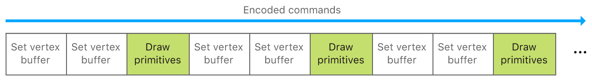
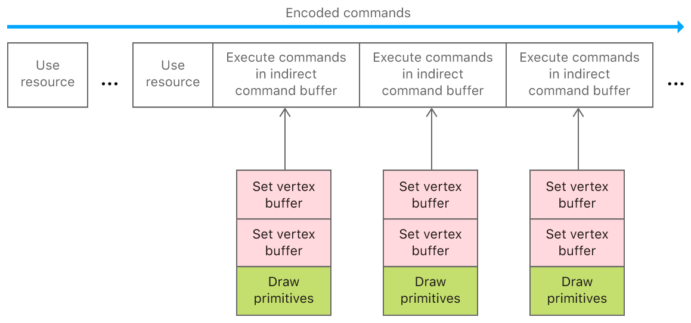
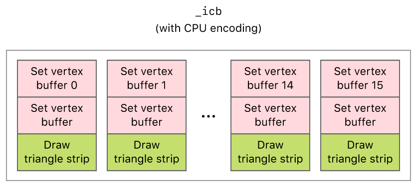

# Encoding Indirect Command Buffers on the CPU

Reduce CPU overhead and simplify your command execution by reusing commands. 

## Overview

This sample app provides an introduction to *indirect command buffers* (ICB), which enable you to store repeated commands for later use. Because Metal discards a normal command buffer and its commands after Metal executes them, use ICBs to save expensive allocation, deallocation, and encoding time for your app's common instructions. Additionally, you benefit when using ICBs with: 
- A reduction in rendering tasks because you execute an ICB with a single call. 
- By creating ICBs at initialization, it moves expensive command management out of your app's critical path at rendering or compute-time. 

An example of where ICBs are effective is with a game’s head-up display (HUD), because:
- You render HUDs every frame. 
- The appearance of the HUD is usually static across frames.

ICBs are also useful to render static objects in typical 3D scenes. Because encoded commands typically result in lightweight data structures, ICBs are suitable for saving complex draws, too.  

This sample demonstrates how to set up an ICB to repeatedly render a series of shapes. While it's possible to gain even more instruction-parallelism by encoding the ICB on the GPU, this sample encodes an ICB on the CPU for simplicity. See [Encoding Indirect Command Buffers on the GPU](https://developer.apple.com/documentation/metal/indirect_command_buffers/encoding_indirect_command_buffers_on_the_gpu) for the more advanced usage. 

## Getting Started

This sample contains macOS and iOS targets. Run the iOS scheme on a physical device because Metal isn't supported in the simulator.

ICBs are supported by GPUs of family greater than or equal to: 
* `MTLFeatureSet_iOS_GPUFamily3_v4`
* `MTLFeatureSet_macOS_GPUFamily2_v1`

You check the GPU that you choose at runtime if it supports ICBs using `MTLDevice`'s [supportsFeatureSet:](https://developer.apple.com/documentation/metal/mtldevice/1433418-supportsfeatureset?language=objc): 

``` objective-c
#if TARGET_IOS
    supportICB = [_view.device supportsFeatureSet:MTLFeatureSet_iOS_GPUFamily3_v4];
#else
    supportICB = [_view.device supportsFeatureSet:MTLFeatureSet_macOS_GPUFamily2_v1];
#endif
```

This sample calls 'supportsFeatureSet:' for this purpose within its view controller's `viewDidLoad:` callback.

## Individual Commands Versus Indirect Command Buffers

Metal apps, particularly games, typically contain multiple render commands, each associated with a set of render states, buffers, and draw calls. To execute these commands for a render pass, apps first encode them into a render command encoder within a command buffer.

You encode individual commands into a render command encoder by calling `MTLRenderCommandEncoder` methods such as `setVertexBuffer:offset:atIndex:` or `drawPrimitives:vertexStart:vertexCount:vertexCount:instanceCount:baseInstance:`.



Recreating draws that were equivalent to ones you did in a previous queue can be tedious from a coding perspective and non-performant at runtime. Instead, move your repeated draws and their data buffers into an `MTLIndirectCommandBuffer` object using `MTLIndirectRenderCommand`, thereby filling the ICB with commands. When you're ready to use the ICB, encode individual executions of it by calling `MTLRenderCommandEnoder`'s `executeCommandsInBuffer:withRange:`.



- Note: To access individual buffers referenced by an indirect command buffer, you must call the `useResource:usage:` method for each buffer that you want to use. For more information, see the "Execute an Indirect Command Buffer" section.

## Define Render Commands and Inherited Render State

For the indirect command buffer, `_indirectCommandBuffer`, the sample defines render commands that:

1. Set a vertex buffer using unique vertex data for each mesh
2. Set another vertex buffer using common transformation data for all meshes
3. Set another vertex buffer containing an array of parameters for each mesh
4. Draw the mesh's triangles

The sample encodes these commands differently for the CPU or the GPU. However, these commands are still encoded into both versions of the indirect command buffer.

The sample also allows `_indirectCommandBuffer` to inherit the render pipeline state from its parent encoder, `renderEncoder`. Furthermore, `_indirectCommandBuffer` implicitly inherits any render state that can't be encoded into it, such as the cull mode and depth or stencil state for the render pass.

## Create an Indirect Command Buffer

The sample creates `_indirectCommandBuffer` from a `MTLIndirectCommandBufferDescriptor`, which defines the features and limits of an indirect command buffer.

``` objective-c
        MTLIndirectCommandBufferDescriptor* icbDescriptor = [MTLIndirectCommandBufferDescriptor new];

        // Indicate that the only draw commands will be standard (non-indexed) draw commands.
        icbDescriptor.commandTypes = MTLIndirectCommandTypeDraw;

        // Indicate that buffers will be set for each command IN the indirect command buffer.
        icbDescriptor.inheritBuffers = NO;

        // Indicate that a max of 3 buffers will be set for each command.
        icbDescriptor.maxVertexBufferBindCount = 3;
        icbDescriptor.maxFragmentBufferBindCount = 0;

#if defined TARGET_MACOS || defined(__IPHONE_13_0)
        // Indicate that the render pipeline state object will be set in the render command encoder
        // (not by the indirect command buffer).
        // On iOS, this property only exists on iOS 13 and later.  It defaults to YES in earlier
        // versions
        if (@available(iOS 13.0, *)) {
            icbDescriptor.inheritPipelineState = YES;
        }
#endif

        _indirectCommandBuffer = [_device newIndirectCommandBufferWithDescriptor:icbDescriptor
                                                                 maxCommandCount:AAPLNumObjects
                                                                         options:0];
```

The sample specifies the types of commands, `commandTypes`, and the maximum number of commands, `maxCount`, so that Metal reserves enough space in memory for the sample to encode `_indirectCommandBuffer` successfully (with the CPU or GPU).

## Encode an Indirect Command Buffer with the CPU

From the CPU, the sample encodes commands into `_indirectCommandBuffer` with a `MTLIndirectRenderCommand` object. For each shape to be rendered, the sample encodes two `setVertexBuffer:offset:atIndex:` commands and one `drawPrimitives:vertexStart:vertexCount:instanceCount:baseInstance:` command.

``` objective-c
//  Encode a draw command for each object drawn in the indirect command buffer.
for (int objIndex = 0; objIndex < AAPLNumObjects; objIndex++)
{
    id<MTLIndirectRenderCommand> ICBCommand =
        [_indirectCommandBuffer indirectRenderCommandAtIndex:objIndex];

    [ICBCommand setVertexBuffer:_vertexBuffer[objIndex]
                         offset:0
                        atIndex:AAPLVertexBufferIndexVertices];

    [ICBCommand setVertexBuffer:_indirectFrameStateBuffer
                         offset:0
                        atIndex:AAPLVertexBufferIndexFrameState];

    [ICBCommand setVertexBuffer:_objectParameters
                         offset:0
                        atIndex:AAPLVertexBufferIndexObjectParams];

    const NSUInteger vertexCount = _vertexBuffer[objIndex].length/sizeof(AAPLVertex);

    [ICBCommand drawPrimitives:MTLPrimitiveTypeTriangle
                   vertexStart:0
                   vertexCount:vertexCount
                 instanceCount:1
                  baseInstance:objIndex];
}
```

The sample performs this encoding only once, before encoding any subsequent render commands. `_indirectCommandBuffer` contains a total of 16 draw calls, one for each shape to be rendered. Each draw call references the same transformation data, `_uniformBuffers`, but different vertex data, `_vertexBuffers[indx]`. Although the CPU encodes data only once, the sample issues 16 draw calls per frame.



## Update the Data Used by an ICB

To update data that's fed to the GPU, you typically cycle through a set of buffers such that the CPU updates one while the GPU reads another (see [CPU and GPU Synchronization](https://developer.apple.com/documentation/metal/synchronization/synchronizing_cpu_and_gpu_work)). You can't apply that pattern literally with ICBs, however, because you can't update an ICB's buffer set after you encode its commands, but you follow a two-step process to blit data updates from the CPU. First, update a single buffer in your dynamic buffer array on the CPU: 

``` objective-c
_frameNumber++;

_inFlightIndex = _frameNumber % AAPLMaxFramesInFlight;

AAPLFrameState * frameState = _frameStateBuffer[_inFlightIndex].contents;
```

Then, blit the CPU-side buffer set to the location that's accessible to the ICB (see _indirectFrameStateBuffer):

``` objective-c
/// Encode blit commands to update the buffer holding the frame state.
id<MTLBlitCommandEncoder> blitEncoder = [commandBuffer blitCommandEncoder];

[blitEncoder copyFromBuffer:_frameStateBuffer[_inFlightIndex] sourceOffset:0
                   toBuffer:_indirectFrameStateBuffer destinationOffset:0
                       size:_indirectFrameStateBuffer.length];

[blitEncoder endEncoding];
```

## Execute an Indirect Command Buffer

The sample calls the `executeCommandsInBuffer:withRange:` method to execute the commands in `_indirectCommandBuffer`.

``` objective-c
// Draw everything in the indirect command buffer.
[renderEncoder executeCommandsInBuffer:_indirectCommandBuffer withRange:NSMakeRange(0, AAPLNumObjects)];
```

Similar to the arguments in an argument buffer, the sample calls the `useResource:usage:` method to indicate that the GPU can access the resources within an indirect command buffer.

``` objective-c
// Make a useResource call for each buffer needed by the indirect command buffer.
for (int i = 0; i < AAPLNumObjects; i++)
{
    [renderEncoder useResource:_vertexBuffer[i] usage:MTLResourceUsageRead];
}

[renderEncoder useResource:_objectParameters usage:MTLResourceUsageRead];

[renderEncoder useResource:_indirectFrameStateBuffer usage:MTLResourceUsageRead];
```

The sample continues to execute `_indirectCommandBuffer` each frame.
