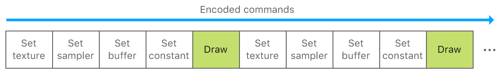
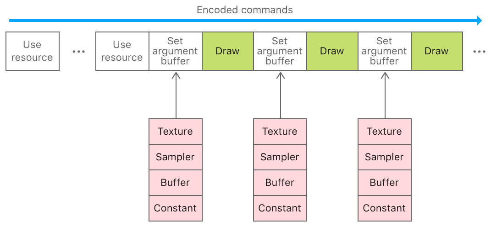

# Managing Groups of Resources with Argument Buffers

Create argument buffers to organize related resources.

## Overview

An argument buffer represents a group of resources that can be collectively assigned as an argument to a graphics or compute function. You use argument buffers to reduce CPU overhead, simplify resource management, and implement GPU-driven pipelines.

In this sample, you'll learn how to specify, encode, set, and access resources in an argument buffer. In particular, you'll learn about the advantages of managing groups of resources in an argument buffer instead of individual resources. The sample renders a static quad using a texture, sampler, buffer, and constant encoded into an argument buffer.

## Getting Started

The Xcode project contains schemes for running the sample on macOS, iOS, or tvOS.  The default scheme is macOS, which runs the sample as is on your Mac.

## CPU Overhead and Argument Buffers

Metal commands are efficient, incurring minimal CPU overhead when apps access the GPU. Each command does incur some overhead, however; to further reduce the amount, use these strategies:
* Do more GPU work with fewer CPU commands.
* Avoid repeating expensive CPU commands.

Metal's *argument buffer* feature reduces the number and performance cost of CPU commands in your app's critical path (for example, in your app's render loop). An argument buffer allows you to group and encode multiple resources within a single buffer, instead of encoding each resource individually. By using argument buffers, you can shift a significant amount of CPU overhead from your app's critical path to its initial setup.

## Individual Resources versus Argument Buffers

Metal apps, particularly games, typically contain multiple 3D objects, each associated with a set of resources such as textures, samplers, buffers, and constants. To render each object, apps encode Metal commands that set these resources as arguments to a graphics function before issuing a draw call.

You set individual resources as arguments by calling `MTLRenderCommandEncoder` methods such as `setVertexBuffer:offset:atIndex:` or `setFragmentTexture:atIndex:` for each resource.



Commands that set individual resources can become numerous and expensive, especially for large apps or games. Instead, you can group related resources into an argument buffer and then set that entire buffer as a single argument to a graphics function. This approach greatly reduces CPU overhead and still provides individual GPU access to your resources.

Argument buffers are represented as `MTLBuffer` objects. Therefore, you set them as arguments by calling `MTLRenderCommandEncoder` methods such as `setVertexBuffer:offset:atIndex:` or `setFragmentBuffer:offset:atIndex:` for each argument buffer.



- Note: To access individual resources in an argument buffer, you must call the `useResource:usage:` method for each resource that you want to use. For more information, see the "Enable the GPU Memory of Resources in the Argument Buffer" section.

## Define Argument Buffers

Argument buffers are defined as custom structures in the Metal Shading Language. Each structure element represents an individual resource, declared as a texture, sampler, buffer, or constant data type. A structure element is also associated with an integer, declared with the `[[id(n)]]` attribute qualifier, that specifies the index of the individual resource.

The argument buffer in this sample is declared as a `FragmentShaderArguments` structure and this is its definition:

``` metal
struct FragmentShaderArguments {
    texture2d<half> exampleTexture  [[ id(AAPLArgumentBufferIDExampleTexture)  ]];
    sampler         exampleSampler  [[ id(AAPLArgumentBufferIDExampleSampler)  ]];
    device float   *exampleBuffer   [[ id(AAPLArgumentBufferIDExampleBuffer)   ]];
    uint32_t        exampleConstant [[ id(AAPLArgumentBufferIDExampleConstant) ]];
};
```

This argument buffer contains the following resources:

* `exampleTexture`, a 2D texture with an index of `0`.

* `exampleSampler`, a sampler with an index of `1`.

* `exampleBuffer`, a `float` buffer with an index of `2`.

* `exampleConstant`, a `uint32_t` constant with an index of `3`.

This sample's fragment function, `fragmentShader`, uses the argument buffer as a single parameter.

``` metal
fragment float4
fragmentShader(       RasterizerData            in                 [[ stage_in ]],
               device FragmentShaderArguments & fragmentShaderArgs [[ buffer(AAPLFragmentBufferIndexArguments) ]])
```

The `fragmentShaderArgs` parameter is a buffer of type `FragmentShaderArguments`. When the sample sets a `MTLBuffer` as an argument to the fragment function, the function interprets the data in the `fragmentShaderArgs` parameter as an argument buffer with a texture, sampler, buffer, and constant (as defined by the `FragmentShaderArguments` structure).

## Encode Resources into an Argument Buffer

Individual resources must be encoded into an argument buffer before the buffer is accessed by a function. This is accomplished by creating a `MTLArgumentBufferEncoder` from a `MTLFunction` that uses an argument buffer.

This sample creates a `MTLArgumentBufferEncoder` from the `fragmentShader` function, which contains the `fragmentShaderArgs` parameter.

``` objective-c
id <MTLFunction> fragmentFunction = [defaultLibrary newFunctionWithName:@"fragmentShader"];

id <MTLArgumentEncoder> argumentEncoder =
    [fragmentFunction newArgumentEncoderWithBufferIndex:AAPLFragmentBufferIndexArguments];
```

The `encodedLength` property of `argumentEncoder` determines the size, in bytes, required to contain all the resources in the argument buffer. This sample uses that value to create a new buffer, `_fragmentShaderArgumentBuffer`, with a `length` parameter that matches the required size for the argument buffer.

``` objective-c
NSUInteger argumentBufferLength = argumentEncoder.encodedLength;

_fragmentShaderArgumentBuffer = [_device newBufferWithLength:argumentBufferLength options:0];
```

This sample then calls the `setArgumentBuffer:offset:` method to specify that `_fragmentShaderArgumentBuffer` is an argument buffer that resources can be encoded into.

``` objective-c
[argumentEncoder setArgumentBuffer:_fragmentShaderArgumentBuffer offset:0];
```

This sample encodes individual resources into the argument buffer by:

* Calling specific methods for each resource type, such as `setTexture:atIndex:`, `setSamplerState:atIndex:`, and `setBuffer:offset:atIndex`.

* Matching the value of the `index` parameter to the value of the `[[id(n)]]` attribute qualifier declared for each element of the `FragmentShaderArguments` structure.

``` objective-c
[argumentEncoder setTexture:_texture atIndex:AAPLArgumentBufferIDExampleTexture];
[argumentEncoder setSamplerState:_sampler atIndex:AAPLArgumentBufferIDExampleSampler];
[argumentEncoder setBuffer:_indirectBuffer offset:0 atIndex:AAPLArgumentBufferIDExampleBuffer];
```

Constants are encoded a bit differently; constant data is embedded directly into the argument buffer, instead of residing in another object that the argument buffer points to. This sample calls the `constantDataAtIndex:` method to retrieve the address in the argument buffer in which the constant resides. Then, the sample sets the actual value of the constant, `bufferElements`, at the retrieved address.

``` objective-c
uint32_t *numElementsAddress = [argumentEncoder constantDataAtIndex:AAPLArgumentBufferIDExampleConstant];

*numElementsAddress = bufferElements;
```

## Enable the GPU Memory of Resources in the Argument Buffer

Metal efficiently manages memory accessed by the GPU; before the GPU uses any resource, Metal ensures that the GPU has access to the resource's memory. Setting resources individually, by calling `MTLRenderCommandEncoder` methods such as `setVertexBuffer:offset:atIndex:` or `setFragmentTexture:atIndex:`, ensures that the resource's memory is accessible to the GPU.

However, when resources are encoded into an argument buffer, setting the argument buffer doesn't set each of its resources individually. Metal doesn't inspect argument buffers to determine which resources are encoded in them (this expensive operation would negate the performance benefits of argument buffers). Therefore, Metal can't determine what resource's memory to make accessible to the GPU. Instead, you call the `useResource:usage:` method to explicitly instruct a `MTLRenderCommandEncoder` to make a specific resource's memory accessible to the GPU.

- Note: You only need to call the `useResource:usage:` method once for each resource during the lifetime of a `MTLRenderCommandEncoder`, even if you use the resource in multiple draw calls. The `useResource:usage:` method is specific to argument buffers, but calling it is far less expensive than setting each resource individually.

## Set Argument Buffers

This sample calls the `useResource:usage:` method for the `_texture` and `_indirectBuffer` resources encoded into the argument buffer. These calls specify `MTLResourceUsage` values that further indicate which GPU operations are performed on each resource (the texture is sampled and the buffer is read in the GPU).

``` objective-c
[renderEncoder useResource:_texture usage:MTLResourceUsageSample];
[renderEncoder useResource:_indirectBuffer usage:MTLResourceUsageRead];
```

- Note: The `useResource:usage:` method doesn't apply to samplers or constants because they're not `MTLResource` objects.

This sample sets only `_fragmentShaderArgumentBuffer` as an argument to the fragment function; it doesn't set the `_texture`, `_indirectBuffer`, `_sampler`, or `bufferElements` resources individually. This command allows the fragment function to access the argument buffer and its encoded resources.

``` objective-c
[renderEncoder setFragmentBuffer:_fragmentShaderArgumentBuffer
                          offset:0
                         atIndex:AAPLFragmentBufferIndexArguments];
```

## Access the Resources in an Argument Buffer

Within a function, accessing resources encoded in an argument buffer is similar to accessing individual resources directly. The main difference is that the resources are accessed as  elements of the argument buffer structure.

In this sample, argument buffer resources are accessed via the `fragmentShaderArgs` parameter of the `fragmentShader` function.

``` metal
// Get the sampler encoded in the argument buffer
sampler exampleSampler = fragmentShaderArgs.exampleSampler;

// Sample the texture encoded in the argument buffer
half4 textureSample = fragmentShaderArgs.exampleTexture.sample(exampleSampler, in.texCoord);

// Use the fragment position and the constant encoded in the argument buffer to calculate an array index
uint32_t index = (uint32_t)in.position.x % fragmentShaderArgs.exampleConstant;

// Index into the buffer encoded in the argument buffer
float colorScale = fragmentShaderArgs.exampleBuffer[index];
```

The sample uses all four resources in the argument buffer to produce the final color for each fragment.

## Next Steps

In this sample, you learned how to specify, encode, set, and access resources in an argument buffer. In the [Argument Buffers with Arrays and Resource Heaps](https://developer.apple.com/documentation/metal/buffers/using_argument_buffers_with_resource_heaps) sample, you'll learn how to combine argument buffers with arrays of resources and resource heaps.
