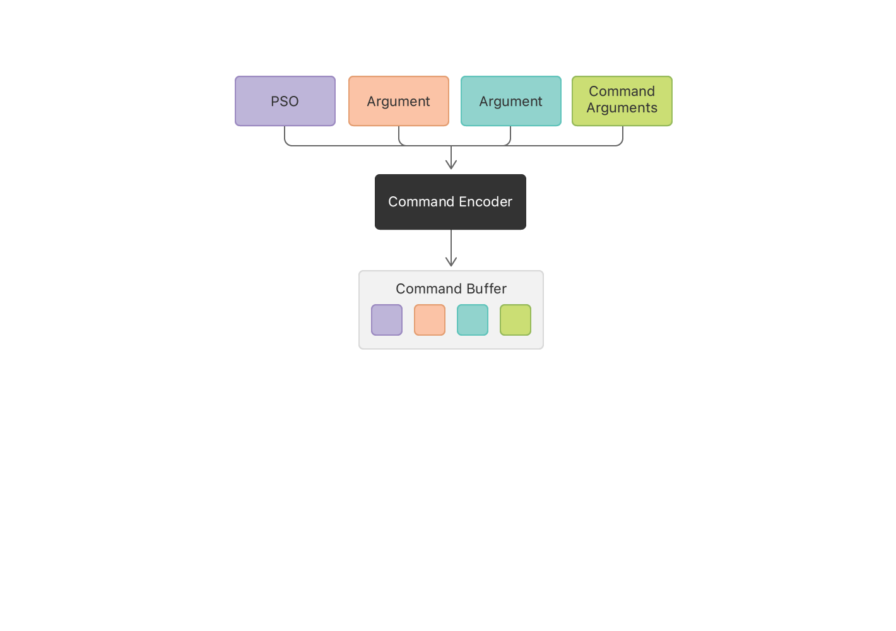

# Performing Calculations on a GPU

Use Metal to find GPUs and perform calculations on them.

## Overview

In this sample, you’ll learn essential tasks that are used in all Metal apps.
You'll see how to convert a simple function written in C to Metal Shading Language (MSL) so that it can be run on a GPU.
You'll find a GPU, prepare the MSL function to run on it by creating a pipeline, and create data objects accessible to the GPU.
To execute the pipeline against your data, create a *command buffer*, write commands into it, and commit the buffer to a command queue.
Metal sends the commands to the GPU to be executed.

## Write a GPU Function to Perform Calculations

To illustrate GPU programming, this app adds corresponding elements of two arrays together, writing the results to a third array.
Listing 1 shows a function that performs this calculation on the CPU, written in C.
It loops over the index, calculating one value per iteration of the loop.


**Listing 1** Array addition, written in C

``` objective-c
void add_arrays(const float* inA,
                const float* inB,
                float* result,
                int length)
{
    for (int index = 0; index < length ; index++)
    {
        result[index] = inA[index] + inB[index];
    }
}
```

Each value is calculated independently, so the values can be safely calculated concurrently.
To perform the calculation on the GPU, you need to rewrite this function in Metal Shading Language (MSL).
MSL is a variant of C++ designed for GPU programming.
In Metal, code that runs on GPUs is called a *shader*, because historically they were first used to calculate colors in 3D graphics.
Listing 2 shows a shader in MSL that performs the same calculation as Listing 1.
The sample project defines this function in the `add.metal` file.
Xcode builds all `.metal` files in the application target and creates a default Metal library, which it embeds in your app.
You’ll see how to load the default library later in this sample.

**Listing 2** Array addition, written in MSL
``` metal
kernel void add_arrays(device const float* inA,
                       device const float* inB,
                       device float* result,
                       uint index [[thread_position_in_grid]])
{
    // the for-loop is replaced with a collection of threads, each of which
    // calls this function.
    result[index] = inA[index] + inB[index];
}
```

Listing 1 and Listing 2 are similar, but there are some important differences in the MSL version. Take a closer look at Listing 2. 

First, the function adds the `kernel` keyword, which declares that the function is:

- A *public GPU function*. Public functions are the only functions that your app can see. Public functions also can't be called by other shader functions.
- A *compute function* (also known as a compute kernel), which performs a parallel calculation using a grid of threads.

See [Using a Render Pipeline to Render Primitives](https://developer.apple.com/documentation/metal/using_a_render_pipeline_to_render_primitives) to learn the other function keywords used to declare public graphics functions.

The `add_arrays` function declares three of its arguments with the `device` keyword, which says that these pointers are in the `device` address space.
MSL defines several disjoint address spaces for memory.
Whenever you declare a pointer in MSL, you must supply a keyword to declare its address space.
Use the `device` address space to declare persistent memory that the GPU can read from and write to.

Listing 2 removes the for-loop from Listing 1, because the function is now going to be called by multiple threads in the compute grid. 
This sample creates a 1D grid of threads that exactly matches the array's dimensions, so that each entry in the array is calculated by a different thread.

To replace the index previously provided by the for-loop, the function takes a new `index` argument, with another MSL keyword, `thread_position_in_grid`, specified using C++ attribute syntax.
This keyword declares that Metal should calculate a unique index for each thread and pass that index in this argument.
Because `add_arrays` uses a 1D grid, the index is defined as a scalar integer.
Even though the loop was removed, Listing 1 and Listing 2 use the same line of code to add the two numbers together.
If you want to convert similar code from C or C++ to MSL, replace the loop logic with a grid in the same way.

## Find a GPU

In your app, a [`MTLDevice`][MTLDevice] object is a thin abstraction for a GPU; you use it to communicate with a GPU.
Metal creates a `MTLDevice` for each GPU.
You get the default device object by calling [`MTLCreateSystemDefaultDevice()`][MTLCreateSystemDefaultDevice].
In macOS, where a Mac can have multiple GPUs, Metal chooses one of the GPUs as the default and returns that GPU's device object.
In macOS, Metal provides other APIs that you can use to retrieve all of the device objects, but this sample just uses the default.

``` objective-c
id<MTLDevice> device = MTLCreateSystemDefaultDevice();
```

## Initialize Metal Objects

Metal represents other GPU-related entities, like compiled shaders, memory buffers and textures, as objects.
To create these GPU-specific objects, you call methods on a [`MTLDevice`][MTLDevice] or you call methods on objects created by a [`MTLDevice`][MTLDevice].
All objects created directly or indirectly by a device object are usable only with that device object.
Apps that use multiple GPUs will use multiple device objects and create a similar hierarchy of Metal objects for each.

The sample app uses a custom `MetalAdder` class to manage the objects it needs to communicate with the GPU.
The class's initializer creates these objects and stores them in its properties.
The app creates an instance of this class, passing in the Metal device object to use to create the secondary objects. The `MetalAdder` object keeps strong references to the Metal objects until it finishes executing.

``` objective-c
MetalAdder* adder = [[MetalAdder alloc] initWithDevice:device];
```

In Metal, expensive initialization tasks can be run once and the results retained and used inexpensively.
You rarely need to run such tasks in performance-sensitive code.


## Get a Reference to the Metal Function


The first thing the initializer does is load the function and prepare it to run on the GPU.
When you build the app, Xcode compiles the `add_arrays` function and adds it to a default Metal library that it embeds in the app.
You use `MTLLibrary` and `MTLFunction` objects to get information about Metal libraries and the functions contained in them. 
To get an object representing the `add_arrays` function, ask the [`MTLDevice`][MTLDevice] to create a [`MTLLibrary`][MTLLibrary] object for the default library, and then ask the library for a [`MTLFunction`][MTLFunction] object that represents the shader function.

``` objective-c
- (instancetype) initWithDevice: (id<MTLDevice>) device
{
    self = [super init];
    if (self)
    {
        _mDevice = device;

        NSError* error = nil;

        // Load the shader files with a .metal file extension in the project

        id<MTLLibrary> defaultLibrary = [_mDevice newDefaultLibrary];
        if (defaultLibrary == nil)
        {
            NSLog(@"Failed to find the default library.");
            return nil;
        }

        id<MTLFunction> addFunction = [defaultLibrary newFunctionWithName:@"add_arrays"];
        if (addFunction == nil)
        {
            NSLog(@"Failed to find the adder function.");
            return nil;
        }
```


## Prepare a Metal Pipeline

The function object is a proxy for the MSL function, but it's not executable code.
You convert the function into executable code by creating a *pipeline*.
A pipeline specifies the steps that the GPU performs to complete a specific task.
In Metal, a pipeline is represented by a *pipeline state object*.
Because this sample uses a compute function, the app creates a [`MTLComputePipelineState`][MTLComputePipelineState] object.

``` objective-c
_mAddFunctionPSO = [_mDevice newComputePipelineStateWithFunction: addFunction error:&error];
```

A compute pipeline runs a single compute function, optionally manipulating the input data before running the function, and the output data afterwards.

When you create a pipeline state object, the device object finishes compiling the function for this specific GPU.
This sample creates the pipeline state object synchronously and returns it directly to the app.
Because compiling does take a while, avoid creating pipeline state objects synchronously in performance-sensitive code.

- Note: All of the objects returned by Metal in the code you've seen so far are returned as objects that conform to protocols.
Metal defines most GPU-specific objects using protocols to abstract away the underlying implementation classes, which may vary for different GPUs.
Metal defines GPU-independent objects using classes.
The reference documentation for any given Metal protocol make it clear whether you can implement that protocol in your app.

## Create a Command Queue

To send work to the GPU, you need a command queue. Metal uses command queues to schedule commands.
Create a command queue by asking the [`MTLDevice`][MTLDevice] for one.

``` objective-c
_mCommandQueue = [_mDevice newCommandQueue];
```


## Create Data Buffers and Load Data

After initializing the basic Metal objects, you load data for the GPU to execute. This task is less performance critical, but still useful to do early in your app's launch.

A GPU can have its own dedicated memory, or it can share memory with the operating system. 
Metal and the operating system kernel need to perform additional work to let you store data in memory and make that data available to the GPU.
Metal abstracts this memory management using *resource* objects. ([`MTLResource`][MTLResource]).
A resource is an allocation of memory that the GPU can access when running commands.
Use a [`MTLDevice`][MTLDevice] to create resources for its GPU.

The sample app creates three buffers and fills the first two with random data.
The third buffer is where `add_arrays` will store its results.

``` objective-c
_mBufferA = [_mDevice newBufferWithLength:bufferSize options:MTLResourceStorageModeShared];
_mBufferB = [_mDevice newBufferWithLength:bufferSize options:MTLResourceStorageModeShared];
_mBufferResult = [_mDevice newBufferWithLength:bufferSize options:MTLResourceStorageModeShared];

[self generateRandomFloatData:_mBufferA];
[self generateRandomFloatData:_mBufferB];
```

The resources in this sample are ([`MTLBuffer`][MTLBuffer]) objects, which are allocations of memory without a predefined format.
Metal manages each buffer as an opaque collection of bytes.
However, you specify the format when you use a buffer in a shader.
This means that your shaders and your app need to agree on the format of any data being passed back and forth. 

When you allocate a buffer, you provide a storage mode to determine some of its performance characteristics and whether the CPU or GPU can access it.
The sample app uses shared memory ([`MTLResourceStorageModeShared`][MTLResourceStorageModeShared]), which both the CPU and GPU can access.

To fill a buffer with random data, the app gets a pointer to the buffer's memory and writes data to it on the CPU. The `add_arrays` function in Listing 2 declared its arguments as arrays of floating-point numbers, so you provide buffers in the same format:

``` objective-c
- (void) generateRandomFloatData: (id<MTLBuffer>) buffer
{
    float* dataPtr = buffer.contents;

    for (unsigned long index = 0; index < arrayLength; index++)
    {
        dataPtr[index] = (float)rand()/(float)(RAND_MAX);
    }
}
```


## Create a Command Buffer
Ask the command queue to create a command buffer.

``` objective-c
id<MTLCommandBuffer> commandBuffer = [_mCommandQueue commandBuffer];
```

## Create a Command Encoder

To write commands into a command buffer, you use a *command encoder* for the specific kind of commands you want to code.
This sample creates a compute command encoder, which encodes a *compute pass*.
A compute pass holds a list of commands that execute compute pipelines.
Each compute command causes the GPU to create a grid of threads to execute on the GPU.

``` objective-c
id<MTLComputeCommandEncoder> computeEncoder = [commandBuffer computeCommandEncoder];
```

To encode a command, you make a series of method calls on the encoder.
Some methods set state information, like the pipeline state object (PSO) or the arguments to be passed to the pipeline.
After you make those state changes, you encode a command to execute the pipeline.
The encoder writes all of the state changes and command parameters into the command buffer.



## Set Pipeline State and Argument Data

Set the pipeline state object of the pipeline you want the command to execute.
Then set data for any arguments that the pipeline needs to send into the `add_arrays` function. 
For this pipeline, that means providing references to three buffers.
Metal automatically assigns indices for the buffer arguments in the order that the arguments appear in the function declaration in Listing 2, starting with `0`.
You provide arguments using the same indices.

``` objective-c
[computeEncoder setComputePipelineState:_mAddFunctionPSO];
[computeEncoder setBuffer:_mBufferA offset:0 atIndex:0];
[computeEncoder setBuffer:_mBufferB offset:0 atIndex:1];
[computeEncoder setBuffer:_mBufferResult offset:0 atIndex:2];
```

You also specify an offset for each argument.
An offset of `0` means the command will access the data from the beginning of a buffer.
However, you could use one buffer to store multiple arguments, specifying an offset for each argument.

You don't specify any data for the index argument because the `add_arrays` function defined its values as being provided by the GPU.

## Specify Thread Count and Organization

Next, decide how many threads to create and how to organize those threads.
Metal can create 1D, 2D, or 3D grids.
The `add_arrays` function uses a 1D array, so the sample creates a 1D grid of size (`dataSize` x 1 x 1), from which Metal generates indices between 0 and `dataSize`-1.

``` objective-c
MTLSize gridSize = MTLSizeMake(arrayLength, 1, 1);
```

## Specify Threadgroup Size

Metal subdivides the grid into smaller grids called *threadgroups*.
Each threadgroup is calculated separately.
Metal can dispatch threadgroups to different processing elements on the GPU to speed up processing.
You also need to decide how large to make the threadgroups for your command.

``` objective-c
NSUInteger threadGroupSize = _mAddFunctionPSO.maxTotalThreadsPerThreadgroup;
if (threadGroupSize > arrayLength)
{
    threadGroupSize = arrayLength;
}
MTLSize threadgroupSize = MTLSizeMake(threadGroupSize, 1, 1);
```

The app asks the pipeline state object for the largest possible threadgroup and shrinks it if that size is larger than the size of the data set.
The [`maxTotalThreadsPerThreadgroup`][maxTotalThreadsPerThreadgroup] property gives the maximum number of threads allowed in the threadgroup, which varies depending on the complexity of the function used to create the pipeline state object.

## Encode the Compute Command to Execute the Threads

Finally, encode the command to dispatch the grid of threads.

``` objective-c
[computeEncoder dispatchThreads:gridSize
          threadsPerThreadgroup:threadgroupSize];
```

When the GPU executes this command, it uses the state you previously set and the command's parameters to dispatch threads to perform the computation.

You can follow the same steps using the encoder to encode multiple compute commands into the compute pass without performing any redundant steps.
For example, you might set the pipeline state object once, and then set arguments and encode a command for each collection of buffers to process.

## End the Compute Pass
When you have no more commands to add to the compute pass, you end the encoding process to close out the compute pass.

``` objective-c
[computeEncoder endEncoding];
```

## Commit the Command Buffer to Execute Its Commands

Run the commands in the command buffer by committing the command buffer to the queue.

``` objective-c
[commandBuffer commit];
```

The command queue created the command buffer, so committing the buffer always places it on that queue.
After you commit the command buffer, Metal asynchronously prepares the commands for execution and then schedules the command buffer to execute on the GPU.
After the GPU executes all the commands in the command buffer, Metal marks the command buffer as complete.

## Wait for the Calculation to Complete

Your app can do other work while the GPU is processing your commands.
This sample doesn't need to do any additional work, so it simply waits until the command buffer is complete.

``` objective-c
[commandBuffer waitUntilCompleted];
```

Alternatively, to be notified when Metal has processed all of the commands, add a completion handler to the command buffer ([`addCompletedHandler`][addCompletedHandler]), or check the status of a command buffer by reading its [`status`][status] property.

## Read the Results From the Buffer

After the command buffer completes, the GPU's calculations are stored in the output buffer and Metal performs any necessary steps to make sure the CPU can see them.
In a real app, you would read the results from the buffer and do something with them, such as displaying the results onscreen or writing them to a file.
Because the calculations are only used to illustrate the process of creating a Metal app, the sample reads the values stored in the output buffer and tests to make sure the CPU and the GPU calculated the same results.

``` objective-c
- (void) verifyResults
{
    float* a = _mBufferA.contents;
    float* b = _mBufferB.contents;
    float* result = _mBufferResult.contents;

    for (unsigned long index = 0; index < arrayLength; index++)
    {
        if (result[index] != (a[index] + b[index]))
        {
            printf("Compute ERROR: index=%lu result=%g vs %g=a+b\n",
                   index, result[index], a[index] + b[index]);
            assert(result[index] == (a[index] + b[index]));
        }
    }
    printf("Compute results as expected\n");
}
```

[MTLDevice]: https://developer.apple.com/documentation/metal/mtldevice
[MTLCreateSystemDefaultDevice]: https://developer.apple.com/documentation/metal/1433401-mtlcreatesystemdefaultdevice
[MTLResource]: https://developer.apple.com/documentation/metal/mtlresource
[MTLBuffer]: https://developer.apple.com/documentation/metal/mtlbuffer
[MTLResourceStorageModeShared]: https://developer.apple.com/documentation/metal/mtlresourceoptions/mtlresourcestoragemodeshared
[MTLComputePipelineState]: https://developer.apple.com/documentation/metal/mtlcomputepipelinestate
[maxTotalThreadsPerThreadgroup]: https://developer.apple.com/documentation/metal/mtlcomputepipelinestate/1414927-maxtotalthreadsperthreadgroup
[status]: https://developer.apple.com/documentation/metal/mtlcommandbuffer/1443048-status
[addCompletedHandler]: https://developer.apple.com/documentation/metal/mtlcommandbuffer/1442997-addcompletedhandler
[MTLLibrary]: https://developer.apple.com/documentation/metal/mtllibrary
[MTLFunction]: https://developer.apple.com/documentation/metal/mtlfunction
[HelloTriangle]: https://developer.apple.com/documentation/metal
