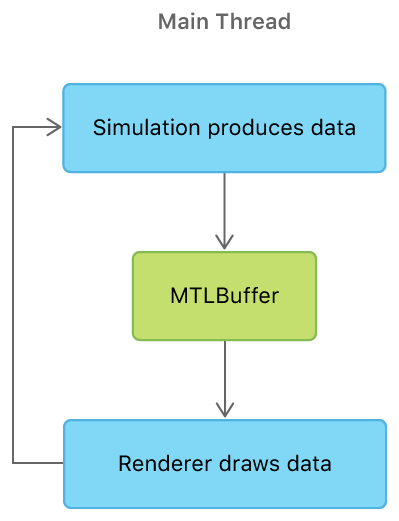

# Selecting Device Objects for Compute Processing

Switch dynamically between multiple GPUs to efficiently execute a compute-intensive simulation.

## Overview

macOS supports systems that have multiple GPUs, enabling Metal apps to increase their computational power. An example is an iMac Pro that has a built-in discrete GPU and is connected to multiple external GPUs. External GPUs can be more powerful than built-in GPUs, so they're a great choice for compute-intensive workloads. However, to take advantage of this added power, Metal apps should be prepared to safely handle adding and removing any external GPUs for more robust execution. Metal apps should always perform well, whether one GPU or multiple GPUs are available to the system.

## Getting Started

Not all Mac computers have multiple GPUs. To check the GPUs in your Mac, choose Apple menu > About this Mac, press the System Report button, and select Graphics/Displays on the left. The GPUs are listed under Video Card.

Optionally, you may connect an external GPU to your Mac via Thunderbolt 3. For this system setup, your Mac must be running macOS 10.13.4 or later. Connecting an external GPU allows the sample to perform compute processing on an external GPU and perform graphics rendering on a built-in GPU.

## Sample Simulation Modes

This sample executes an N-body simulation and continuously renders a subset of the simulation's intermediate results as it progresses to completion. After the simulation has completed, the sample renders all the N-body particles in their final state, presenting the full set of final results.

The sample runs in one of two modes, depending on how many GPUs are available to the system.

**Simulation with a single Metal device.** When only one Metal device is available, the sample executes the simulation and renders the intermediate results serially. The compute simulation and the graphics rendering are performed on the same thread by the same device.


**Simulation with multiple Metal devices.** When multiple Metal devices are available, the sample spawns a second thread to separate the compute processing and graphics rendering work between two GPUs. The threads run concurrently and repeatedly, sharing data as follows:

* The simulation thread produces and transfers intermediate results to system memory.

* The render thread---the main thread---consumes and renders intermediate results from system memory. (All graphics rendering occurs on the main thread.)

![A flowchart that shows the simulation with two Metal devices, one on the simulation thread and the other on the render thread. On the simulation thread, the sample simulates a new frame, and if the simulation is complete, the sample transfers all simulation data to system memory. Otherwise, if the simulation isn't complete, the sample transfers a subset of the simulation data to system memory and repeats the process. On the render thread, the sample creates a buffer with the latest simulation data available in system memory, then renders the simulation data in the buffer, and finally repeats the process.](Documentation/MultiDeviceExecution.png)

The threads don't wait on each other; they work independently at different rates. The simulation thread runs as fast as possible and the render thread runs as fast as the display's frame rate.

## Handle External GPU Notifications

When an external GPU is connected to the system, this sample performs compute simulations on that external GPU and graphics rendering on a built-in GPU. Otherwise, the sample performs both compute and graphics work on a single built-in GPU.

When the sample receives a notification for an external GPU removal, it transfers all compute simulation data from the external GPU to the app's view controller, which then transfers the data to a built-in GPU. This dynamic response ensures that the results of the compute simulation are efficiently retained and transferred for continued processing on a new GPU. It also ensures that the work in progress isn't discarded and the simulation isn't restarted.

When the sample receives a notification for an external GPU addition, it first completes the current simulation with the built-in GPU and then starts the next simulation with the external GPU.

This sample implements many techniques described in [Selecting Device Objects for Graphics Rendering](https://developer.apple.com/documentation/metal/gpu_selection_in_macos/selecting_device_objects_for_graphics_rendering). For information about handling external GPU notifications, see the following sections from that sample:

* Set a GPU Eject Policy

* Register for External GPU Notifications

* Respond to External GPU Notifications

* Deregister from Notifications

## Transfer Simulation Data Between Devices

This sample uses two separate classes to encode Metal commands: `AAPLSimulation` for compute commands and `AAPLRenderer` for graphics commands. The sample uses the simulation class to create a compute pipeline, initialize an N-body data set, and execute the simulation. The sample uses the renderer class to create a render pipeline and draw N-body data produced by the simulation. (The sample uses the `AAPLViewController` class to separate work between the simulation and renderer classes.)

When the sample runs on a single device, the view controller executes the simulation and renderer work serially. For each frame, they both encode commands to the same `MTLCommandBuffer` and they both share the positions of the N-body particles via the same `MTLBuffer`.



When the sample runs on multiple devices, the view controller assigns the simulation work to one device and the renderer work to another. The simulation executes repeatedly in a loop on a separate simulation thread. For each iteration, it updates the positions of the N-body particles and blits this data to a new `MTLBuffer` backed by system memory. The sample passes this system memory backing to the view controller, which then passes it along to the renderer. The renderer executes repeatedly in a loop on the main thread. For each iteration, it creates a new `MTLBuffer`, backed by the same system memory populated by the simulation thread, and renders the N-body particles based on the latest available position data.

- Note: A `MTLBuffer` can't be directly transferred between different devices; its data must be transferred via system memory.


## Allocate System Memory for a Buffer

The sample calls the `vm_allocate` function to allocate a page-aligned buffer, `updateAddress`, backed by system memory. The sample then calls the `newBufferWithBytesNoCopy:length:options:deallocator:` method to create a new `MTLBuffer`, `_updateBuffer`, backed by the same system memory used for the previous buffer.

``` objective-c
void *updateAddress;
kern_return_t err = vm_allocate((vm_map_t)mach_task_self(),
                                (vm_address_t*)&updateAddress,
                                updateDataSize,
                                VM_FLAGS_ANYWHERE);

assert(err == KERN_SUCCESS);

_updateBuffer[i] = [_device newBufferWithBytesNoCopy:updateAddress
                                              length:updateDataSize
                                             options:MTLResourceStorageModeShared
                                         deallocator:nil];
```

Because the app is directly responsible for managing this system memory, the sample calls the `initWithBytesNoCopy:length:deallocator` method to wrap the `updateAddress` buffer in an `NSData` object. This method allows the sample to register a deallocator, `deallocProvidedAddress`, to free the system memory when the app has no more references to the buffer.

``` objective-c
// Block to deallocate memory created with vm_allocate when the NSData object is no
// longer referenced
void (^deallocProvidedAddress)(void *bytes, NSUInteger length) =
    ^(void *bytes, NSUInteger length)
    {
        vm_deallocate((vm_map_t)mach_task_self(),
                      (vm_address_t)bytes,
                      length);
    };

// Create a data object to wrap system memory and pass a deallocator to free the
// memory allocated with vm_allocate when the data object has been released
_updateData[i] = [[NSData alloc] initWithBytesNoCopy:updateAddress
                                              length:updateDataSize
                                         deallocator:deallocProvidedAddress];
```
