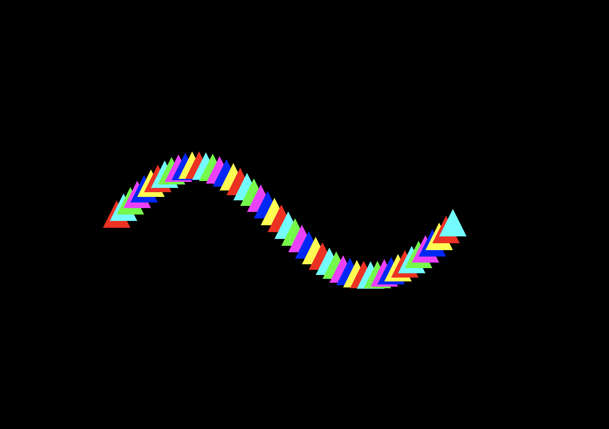
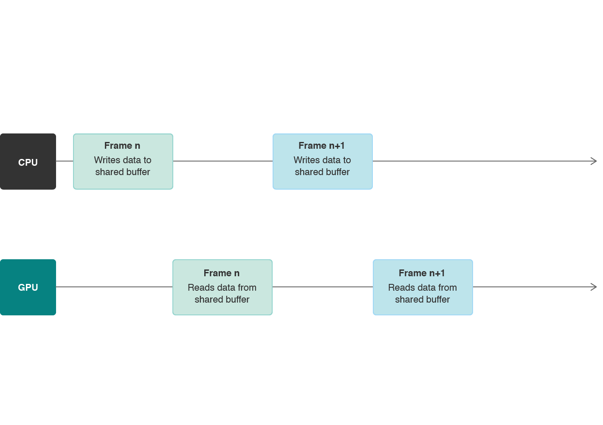
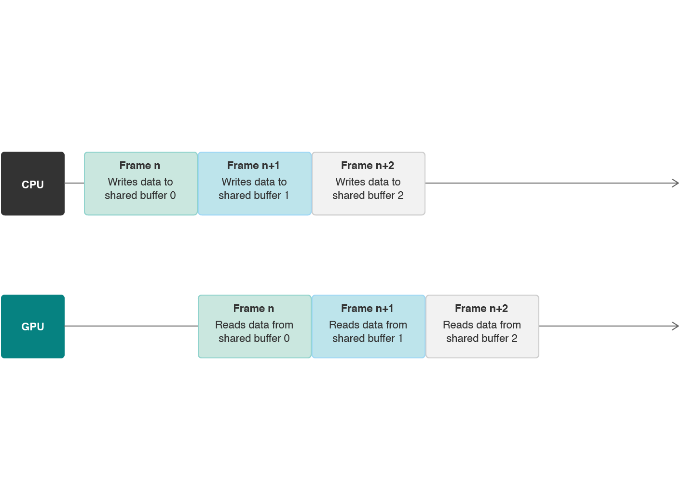

# Synchronizing CPU and GPU Work

Avoid stalls between CPU and GPU work by using multiple instances of a resource.

## Overview

In this sample code project, you learn how to manage data dependencies and avoid processor stalls between the CPU and the GPU.

The project continuously renders triangles along a sine wave. In each frame, the sample updates the position of each triangle's vertices and then renders a new image. These dynamic data updates create an illusion of motion, where the triangles appear to move along the sine wave.



The sample stores the triangle vertices in a buffer that's shared between the CPU and the GPU. The CPU writes data to the buffer and the GPU reads it.

- Note: The Xcode project contains schemes for running the sample on macOS, iOS, and tvOS. The default scheme is macOS, which runs the sample on your Mac.

## Understand the Solution to Data Dependencies and Processor Stalls

Resource sharing creates a *data dependency* between the processors; the CPU must finish writing to the resource before the GPU reads it. If the GPU reads the resource before the CPU writes to it, the GPU reads undefined resource data. If the GPU reads the resource while the CPU is writing to it, the GPU reads incorrect resource data.



These data dependencies create *processor stalls* between the CPU and the GPU; each processor must wait for the other to finish its work before beginning its own work.

However, because the CPU and GPU are separate processors, you can make them work simultaneously by using multiple instances of a resource. Each frame, you must provide the same arguments to your shaders, but this doesn't mean you need to reference the same resource object. Instead, you create a pool of multiple instances of a resource and use a different one each time you render a frame. For example, as shown below, the CPU can write position data to a buffer used for frame `n+1`, at the same time that the GPU reads position data from a buffer used for frame `n`. By using multiple instances of a buffer, the CPU and the GPU can work continuously and avoid stalls as long as you keep rendering frames.



## Initialize Data with the CPU

Define a custom `AAPLVertex` structure that represents a vertex. Each vertex has a position and a color:

``` objective-c
typedef struct
{
    vector_float2 position;
    vector_float4 color;
} AAPLVertex;
```

Define a custom `AAPLTriangle` class that provides an interface to a default triangle, which is made up of 3 vertices:

``` objective-c
+(const AAPLVertex *)vertices
{
    const float TriangleSize = 64;
    static const AAPLVertex triangleVertices[] =
    {
        // Pixel Positions,                          RGBA colors.
        { { -0.5*TriangleSize, -0.5*TriangleSize },  { 1, 1, 1, 1 } },
        { {  0.0*TriangleSize, +0.5*TriangleSize },  { 1, 1, 1, 1 } },
        { { +0.5*TriangleSize, -0.5*TriangleSize },  { 1, 1, 1, 1 } }
    };
    return triangleVertices;
}
```

Initialize multiple triangle vertices with a position and a color, and store them in an array of triangles, `_triangles`:

``` objective-c
NSMutableArray *triangles = [[NSMutableArray alloc] initWithCapacity:NumTriangles];

// Initialize each triangle.
for(NSUInteger t = 0; t < NumTriangles; t++)
{
    vector_float2 trianglePosition;

    // Determine the starting position of the triangle in a horizontal line.
    trianglePosition.x = ((-((float)NumTriangles) / 2.0) + t) * horizontalSpacing;
    trianglePosition.y = 0.0;

    // Create the triangle, set its properties, and add it to the array.
    AAPLTriangle * triangle = [AAPLTriangle new];
    triangle.position = trianglePosition;
    triangle.color = Colors[t % NumColors];
    [triangles addObject:triangle];
}
_triangles = triangles;
```

## Allocate Data Storage

Calculate the total storage size of your triangle vertices. Your app renders 50 triangles; each triangle has 3 vertices, totaling 150 vertices, and each vertex is the size of `AAPLVertex`:

``` objective-c
const NSUInteger triangleVertexCount = [AAPLTriangle vertexCount];
_totalVertexCount = triangleVertexCount * _triangles.count;
const NSUInteger triangleVertexBufferSize = _totalVertexCount * sizeof(AAPLVertex);
```

Initialize multiple buffers to store multiple copies of your vertex data. For each buffer, allocate exactly enough memory to store 150 vertices:

``` objective-c
for(NSUInteger bufferIndex = 0; bufferIndex < MaxFramesInFlight; bufferIndex++)
{
    _vertexBuffers[bufferIndex] = [_device newBufferWithLength:triangleVertexBufferSize
                                                       options:MTLResourceStorageModeShared];
    _vertexBuffers[bufferIndex].label = [NSString stringWithFormat:@"Vertex Buffer #%lu", (unsigned long)bufferIndex];
}
```

Upon initialization, the contents of the buffer instances in the `_vertexBuffers` array are empty.

## Update Data with the CPU

In each frame, at the start of the [`drawInMTKView:`][01] render loop, use the CPU to update the contents of one buffer instance in the `updateState` method:

``` objective-c
// Vertex data for the current triangles.
AAPLVertex *currentTriangleVertices = _vertexBuffers[_currentBuffer].contents;

// Update each triangle.
for(NSUInteger triangle = 0; triangle < NumTriangles; triangle++)
{
    vector_float2 trianglePosition = _triangles[triangle].position;

    // Displace the y-position of the triangle using a sine wave.
    trianglePosition.y = (sin(trianglePosition.x/waveMagnitude + _wavePosition) * waveMagnitude);

    // Update the position of the triangle.
    _triangles[triangle].position = trianglePosition;

    // Update the vertices of the current vertex buffer with the triangle's new position.
    for(NSUInteger vertex = 0; vertex < triangleVertexCount; vertex++)
    {
        NSUInteger currentVertex = vertex + (triangle * triangleVertexCount);
        currentTriangleVertices[currentVertex].position = triangleVertices[vertex].position + _triangles[triangle].position;
        currentTriangleVertices[currentVertex].color = _triangles[triangle].color;
    }
}
```

After you update a buffer instance, you don't access its data with the CPU for the rest of the frame.

- Note: You must finalize all CPU writes to one buffer instance before you commit a command buffer that references it. Otherwise, the GPU may begin reading the buffer instance while the CPU is still writing to it.

## Encode GPU Commands

Next, you encode commands that reference the buffer instance in a render pass:

``` objective-c
[renderEncoder setVertexBuffer:_vertexBuffers[_currentBuffer]
                        offset:0
                       atIndex:AAPLVertexInputIndexVertices];

// Set the viewport size.
[renderEncoder setVertexBytes:&_viewportSize
                       length:sizeof(_viewportSize)
                      atIndex:AAPLVertexInputIndexViewportSize];

// Draw the triangle vertices.
[renderEncoder drawPrimitives:MTLPrimitiveTypeTriangle
                  vertexStart:0
                  vertexCount:_totalVertexCount];
```

## Commit and Execute GPU Commands

At the end of the render loop, call your command buffer's [`commit`][02] method to submit your work to the GPU:

``` objective-c
[commandBuffer commit];
```

The GPU begins its work and reads from the `vertices` buffer in the `RasterizerData` vertex shader, which takes the buffer instance as an input argument:

``` metal
vertex RasterizerData
vertexShader(const uint vertexID [[ vertex_id ]],
             const device AAPLVertex *vertices [[ buffer(AAPLVertexInputIndexVertices) ]],
             constant vector_uint2 *viewportSizePointer  [[ buffer(AAPLVertexInputIndexViewportSize) ]])
```

## Reuse Multiple Buffer Instances in Your App

For each frame, perform the following steps, as described above. A full frame's work is finished when both processors have completed their work.

1. Write data to a buffer instance.
2. Encode commands that reference the buffer instance.
3. Commit a command buffer that contains the encoded commands.
4. Read data from the buffer instance.

When a frame's work is finalized, the CPU and the GPU no longer need the buffer instance used in that frame. However, discarding a used buffer instance and creating a new one for each frame is expensive and wasteful. Instead, as shown below, set up your app to cycle through a first in, first out (FIFO) queue of buffer instances, `_vertexBuffers`, that you can reuse. The maximum number of buffer instances in the queue is defined by the value of `MaxFramesInFlight`, set to 3:

``` objective-c
static const NSUInteger MaxFramesInFlight = 3;
```

In each frame, at the start of the render loop, you update the next buffer instance from the `_vertexBuffer` queue. You cycle through the queue sequentially and update only one buffer instance per frame; at the end of every third frame, you return to the start of the queue:

``` objective-c
// Iterate through the Metal buffers, and cycle back to the first when you've written to the last.
_currentBuffer = (_currentBuffer + 1) % MaxFramesInFlight;

// Update buffer data.
[self updateState];
```

- Note: Core Animation provides optimized displayable resources, commonly referred to as *drawables*, for you to render content and display it onscreen. Drawables are efficient yet expensive system resources, so Core Animation limits the number of drawables that you can use simultaneously in your app. The default limit is 3, but you can set it to 2 with the [`maximumDrawableCount`][03] property (2 and 3 are the only supported values). Because the maximum number of drawables is 3, this sample creates 3 buffer instances. You donʼt need to create more buffer instances than the maximum number of drawables available.

## Manage the Rate of CPU and GPU Work

When you have multiple instances of a buffer, you can make the CPU start work for frame `n+1` with one instance, while the GPU finishes work for frame `n` with another instance. This implementation improves your app's efficiency by making the CPU and the GPU work simultaneously. However, you need to manage your app's rate of work so you don't exceed the number of buffer instances available.

To manage your app's rate of work, use a semaphore to wait for full frame completions in case the CPU is working much faster than the GPU. A semaphore is a non-Metal object that you use to control access to a resource that's shared across multiple processors (or threads). The semaphore has an associated counting value, which you decrement or increment, that indicates whether a processor has started or finished accessing a resource. In your app, a semaphore controls CPU and GPU access to buffer instances.

You initialize the semaphore with a counting value of `MaxFramesInFlight`, to match the number of buffer instances. This value indicates that your app can simultaneously work on a maximum of 3 frames at any given time:

``` objective-c
_inFlightSemaphore = dispatch_semaphore_create(MaxFramesInFlight);
```

At the start of the render loop, you decrement the semaphore's counting value by 1. This indicates that you're ready to work on a new frame. However, if the counting value falls below 0, the semaphore makes the CPU wait until you increment the value:

``` objective-c
dispatch_semaphore_wait(_inFlightSemaphore, DISPATCH_TIME_FOREVER);
```

At the end of the render loop, you register a command buffer completion handler. When the GPU completes the command buffer's execution, it calls this completion handler and you increment the semaphore's counting value by 1. This indicates that you've completed all work for a given frame and you can reuse the buffer instance used in that frame:

``` objective-c
__block dispatch_semaphore_t block_semaphore = _inFlightSemaphore;
[commandBuffer addCompletedHandler:^(id<MTLCommandBuffer> buffer)
 {
     dispatch_semaphore_signal(block_semaphore);
 }];
```

The [`addCompletedHandler:`][04] method registers a block of code that's called immediately after the GPU has finished executing the associated command buffer. Because you use only one command buffer per frame, receiving the completion callback indicates that the GPU has completed the frame.

## Set the Mutability of Your Buffers

Your app performs all per-frame rendering setup on a single thread. First it writes data to a buffer instance with the CPU. After that, it encodes rendering commands that reference the buffer instance. Finally, it commits a command buffer for GPU execution. Because these tasks always happen in this order on a single thread, the app guarantees that it finishes writing data to a buffer instance before it encodes a command that references the buffer instance.

This order allows you to mark your buffer instances as immutable. When you configure your render pipeline descriptor, set the [`mutability`][05] property of the vertex buffer at the buffer instance index to [`MTLMutabilityImmutable`][06]:

``` objective-c
pipelineStateDescriptor.vertexBuffers[AAPLVertexInputIndexVertices].mutability = MTLMutabilityImmutable;
```

Metal can optimize the performance of immutable buffers, but not mutable buffers. For best results, use immutable buffers as much as possible.

[01]:https://developer.apple.com/documentation/metalkit/mtkviewdelegate/1535942-drawinmtkview
[02]:https://developer.apple.com/documentation/metal/mtlcommandbuffer/1443003-commit
[03]:https://developer.apple.com/documentation/quartzcore/cametallayer/2938720-maximumdrawablecount
[04]:https://developer.apple.com/documentation/metal/mtlcommandbuffer/1442997-addcompletedhandler
[05]:https://developer.apple.com/documentation/metal/mtlpipelinebufferdescriptor/2879274-mutability
[06]:https://developer.apple.com/documentation/metal/mtlmutability/mtlmutabilityimmutable
