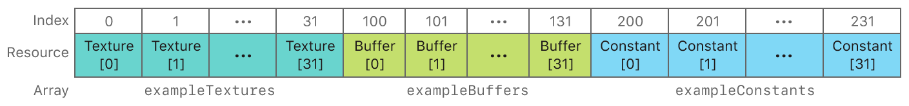

# Using Argument Buffers with Resource Heaps

Reduce CPU overhead by using arrays inside argument buffers and combining them with resource heaps.

## Overview

In the [Managing Groups of Resources with Argument Buffers](https://developer.apple.com/documentation/metal/buffers/managing_groups_of_resources_with_argument_buffers) sample, you learned how to specify, encode, set, and access resources in an argument buffer.

In this sample, you'll learn how to combine argument buffers with arrays of resources and resource heaps. In particular, you'll learn how to define an argument buffer structure that contains arrays and how to allocate and use resources from a heap. The sample renders a static quad that uses multiple resources encoded into an argument buffer.

## Getting Started

The Xcode project contains schemes for running the sample on macOS, iOS, or tvOS. Metal is not supported in the iOS or tvOS Simulator, so the iOS and tvOS schemes require a physical device to run the sample. The default scheme is macOS, which runs the sample as is on your Mac.

## Arrays of Arguments in the Metal Shading Language

Arrays can be used as parameters to graphics or compute functions. When a function takes an array as a parameter, the index of the first resource in the array is equal to the base index of the array parameter itself. Thus, each subsequent resource in the array is automatically assigned a subsequent index value, counting incrementally from the base index value.

For example, the following fragment function, `exampleFragmentFunction`, has a parameter, `textureParameters`, that's an array of 10 textures with a base index value of `5`.

``` metal
fragment float4
exampleFragmentFunction(array<texture2d<float>, 10> textureParameters [[ texture(5) ]])
```

Because `textureParameters` has a `[[ texture(5) ]]` attribute qualifier, the corresponding Metal framework method to set this parameter is `setFragmentTexture:atIndex:`, where the values for `index` begin at `5`. Thus, the texture at array index `0` is set at index number `5`, the texture at array index `1` is set at index number `6`, and so on. The last texture in the array, at array index `9`, is set at index number `14`.

## Define Argument Buffers with Arrays

Arrays can also be used as elements of an argument buffer structure. In this case, the `[[ id(n) ]]` attribute qualifier of an argument buffer behaves the same way as the `[[ texture(n) ]]` attribute qualifier of a function parameter, where `n` is the base index value of the array. However, you don't call the `setFragmentTexture:atIndex:` method, of a `MTLRenderCommandEncoder` object, to set a texture from the array. Instead, you call the `setTexture:atIndex:` method, of a `MTLArgumentEncoder` object, to encode a texture from the array into the argument buffer, where `index` corresponds to the base index value, `n`,  plus the index of the texture within the array.

The argument buffer in this sample is declared as a `FragmentShaderArguments` structure, and this is its definition:

``` metal
struct FragmentShaderArguments {
    array<texture2d<float>, AAPLNumTextureArguments> exampleTextures  [[ id(AAPLArgumentBufferIDExampleTextures)  ]];
    array<device float *,  AAPLNumBufferArguments>   exampleBuffers   [[ id(AAPLArgumentBufferIDExampleBuffers)   ]];
    array<uint32_t, AAPLNumBufferArguments>          exampleConstants [[ id(AAPLArgumentBufferIDExampleConstants) ]];
};
```

Each element of this structure uses the `array<T, N>` template, which defines the element as an array of a certain type, `T`, and number of elements, `N`. This argument buffer contains the following resources:

* `exampleTextures`, an array of 32 2D textures with a base index value of `0`.

* `exampleBuffers`, an array of 32 `float` buffers with a base index value of `100`.

* `exampleConstants`, an array of 32 `uint32_t` constants with a base index value of `200`.



## Encode Array Elements into an Argument Buffer

This sample encodes array elements into an argument buffer by matching the `index` parameter of each `setTexture:atIndex:`, `setBuffer:offset:atIndex:`, and `constantDataAtIndex:` method call to the element's corresponding index value, defined by the `[[ id(n) ]]` attribute qualifier in the argument buffer.

``` objective-c
for(uint32_t i = 0; i < AAPLNumTextureArguments; i++)
{
    [argumentEncoder setTexture:_texture[i]
                        atIndex:AAPLArgumentBufferIDExampleTextures+i];
}
```

``` objective-c
for(uint32_t i = 0; i < AAPLNumBufferArguments; i++)
{
    [argumentEncoder setBuffer:_dataBuffer[i]
                        offset:0
                        atIndex:AAPLArgumentBufferIDExampleBuffers+i];

    uint32_t *elementCountAddress =
        [argumentEncoder constantDataAtIndex:AAPLArgumentBufferIDExampleConstants+i];

    *elementCountAddress = (uint32_t)_dataBuffer[i].length / 4;
}
```

## Access Array Elements in an Argument Buffer

Within a function, accessing elements of an array encoded in an argument buffer is the same as accessing elements of a standard array. In this sample, the `exampleTextures`, `exampleBuffers`, and `exampleConstants` arrays are accessed via the `fragmentShaderArgs` parameter of the `fragmentShader` function. Each array element is accessed with the `[n]` subscript syntax, where `n` is the index of the element within the array.

``` metal
for(uint32_t textureToSample = 0; textureToSample < AAPLNumTextureArguments; textureToSample++)
{
    float4 textureValue = fragmentShaderArgs.exampleTextures[textureToSample].sample(textureSampler, in.texCoord);

    color += textureValue;
}
```

The `fragmentShader` function contains an `if-else` condition that evaluates the `x` component of `texCoord` to determine which side of the quad the fragment is on. If the fragment is on the left side of the quad, the function samples each texture in the `exampleTextures` array and adds the sampled values to determine the final output color.

If the fragment is on right side of the quad, the function reads a value from the `exampleBuffers` array. The function uses the `x` component of `texCoord` to determine which buffer to read from and then uses the `y` component of `texCoord` to determine where in the buffer to read from. The value in the buffer determines the final output color.

``` metal
// Use texCoord.x to select the buffer to read from
uint32_t bufferToRead = (in.texCoord.x-0.5)*2.0 * (AAPLNumBufferArguments-1);

// Retrieve the number of elements for the selected buffer from
// the array of constants in the argument buffer
uint32_t numElements = fragmentShaderArgs.exampleConstants[bufferToRead];

// Determine the index used to read from the buffer
uint32_t indexToRead = in.texCoord.y * numElements;

// Retrieve the buffer to read from by accessing the array of
// buffers in the argument buffer
device float* buffer = fragmentShaderArgs.exampleBuffers[bufferToRead];

// Read from the buffer and assign the value to the output color
color = buffer[indexToRead];
```

## Combine Argument Buffers with Resource Heaps

The fragment function accesses 32 textures and 32 buffers via the argument buffer, totaling 64 different resources overall. If memory for each of these resources was allocated individually, despite residing in arrays, Metal would need to validate the memory of 64 individual resources before making these resources accessible to the GPU.

Instead, this sample allocates resources from a `MTLHeap` object. A heap is a single memory region from which multiple resources can be allocated. Therefore, the sample can make the heap's entire memory, including the memory of all the resources within the heap, accessible to the GPU by calling the `useHeap:` method once.

The sample implements a `loadResources` method that loads the resource data into temporary `MTLTexture` and `MTLBuffer` objects. Then, the sample implements a `createHeap` method that calculates the total size required to store the resource data in the heap and creates the heap itself.

``` objective-c
- (void) createHeap
{
    MTLHeapDescriptor *heapDescriptor = [MTLHeapDescriptor new];
    heapDescriptor.storageMode = MTLStorageModePrivate;
    heapDescriptor.size =  0;

    // Build a descriptor for each texture and calculate the size required to store all textures in the heap
    for(uint32_t i = 0; i < AAPLNumTextureArguments; i++)
    {
        // Create a descriptor using the texture's properties
        MTLTextureDescriptor *descriptor = [AAPLRenderer newDescriptorFromTexture:_texture[i]
                                                                      storageMode:heapDescriptor.storageMode];

        // Determine the size required for the heap for the given descriptor
        MTLSizeAndAlign sizeAndAlign = [_device heapTextureSizeAndAlignWithDescriptor:descriptor];

        // Align the size so that more resources will fit in the heap after this texture
        sizeAndAlign.size += (sizeAndAlign.size & (sizeAndAlign.align - 1)) + sizeAndAlign.align;

        // Accumulate the size required to store this texture in the heap
        heapDescriptor.size += sizeAndAlign.size;
    }

    // Calculate the size required to store all buffers in the heap
    for(uint32_t i = 0; i < AAPLNumBufferArguments; i++)
    {
        // Determine the size required for the heap for the given buffer size
        MTLSizeAndAlign sizeAndAlign = [_device heapBufferSizeAndAlignWithLength:_dataBuffer[i].length
                                                                         options:MTLResourceStorageModePrivate];

        // Align the size so that more resources will fit in the heap after this buffer
        sizeAndAlign.size +=  (sizeAndAlign.size & (sizeAndAlign.align - 1)) + sizeAndAlign.align;

        // Accumulate the size required to store this buffer in the heap
        heapDescriptor.size += sizeAndAlign.size;
    }

    // Create a heap large enough to store all resources
    _heap = [_device newHeapWithDescriptor:heapDescriptor];
}
```

The sample implements a `moveResourcesToHeap` method that creates permanent `MTLTexture` and `MTLBuffer` objects allocated from the heap. Then, the method uses a `MTLBlitCommandEncoder` to copy the resource data from the temporary objects to the permanent objects.

``` objective-c
- (void)moveResourcesToHeap
{
    // Create a command buffer and blit encoder to copy data from the existing resources to
    // the new resources created from the heap
    id <MTLCommandBuffer> commandBuffer = [_commandQueue commandBuffer];
    commandBuffer.label = @"Heap Copy Command Buffer";

    id <MTLBlitCommandEncoder> blitEncoder = commandBuffer.blitCommandEncoder;
    blitEncoder.label = @"Heap Transfer Blit Encoder";

    // Create new textures from the heap and copy the contents of the existing textures to
    // the new textures
    for(uint32_t i = 0; i < AAPLNumTextureArguments; i++)
    {
        // Create a descriptor using the texture's properties
        MTLTextureDescriptor *descriptor = [AAPLRenderer newDescriptorFromTexture:_texture[i]
                                                                      storageMode:_heap.storageMode];

        // Create a texture from the heap
        id<MTLTexture> heapTexture = [_heap newTextureWithDescriptor:descriptor];

        heapTexture.label = _texture[i].label;

        [blitEncoder pushDebugGroup:[NSString stringWithFormat:@"%@ Blits", heapTexture.label]];

        // Blit every slice of every level from the existing texture to the new texture
        MTLRegion region = MTLRegionMake2D(0, 0, _texture[i].width, _texture[i].height);
        for(NSUInteger level = 0; level < _texture[i].mipmapLevelCount;  level++)
        {

            [blitEncoder pushDebugGroup:[NSString stringWithFormat:@"Level %lu Blit", level]];

            for(NSUInteger slice = 0; slice < _texture[i].arrayLength; slice++)
            {
                [blitEncoder copyFromTexture:_texture[i]
                                 sourceSlice:slice
                                 sourceLevel:level
                                sourceOrigin:region.origin
                                  sourceSize:region.size
                                   toTexture:heapTexture
                            destinationSlice:slice
                            destinationLevel:level
                           destinationOrigin:region.origin];
            }
            region.size.width /= 2;
            region.size.height /= 2;
            if(region.size.width == 0) region.size.width = 1;
            if(region.size.height == 0) region.size.height = 1;

            [blitEncoder popDebugGroup];
        }

        [blitEncoder popDebugGroup];

        // Replace the existing texture with the new texture
        _texture[i] = heapTexture;
    }

    // Create new buffers from the heap and copy the contents of existing buffers to the
    // new buffers
    for(uint32_t i = 0; i < AAPLNumBufferArguments; i++)
    {
        // Create a buffer from the heap
        id<MTLBuffer> heapBuffer = [_heap newBufferWithLength:_dataBuffer[i].length
                                                      options:MTLResourceStorageModePrivate];

        heapBuffer.label = _dataBuffer[i].label;

        // Blit contents of the original buffer to the new buffer
        [blitEncoder copyFromBuffer:_dataBuffer[i]
                       sourceOffset:0
                           toBuffer:heapBuffer
                  destinationOffset:0
                               size:heapBuffer.length];

        // Replace the existing buffer with the new buffer
        _dataBuffer[i] = heapBuffer;
    }

    [blitEncoder endEncoding];
    [commandBuffer commit];
}
```

Before using these resources, instead of calling the `useResource:usage:` method once for each resource, the sample calls the `useHeap:` method once for the entire heap.

``` objective-c
#if ENABLE_RESOURCE_HEAP
        // Make a single `useHeap:` call for the entire heap, instead of one
        // `useResource:usage:` call per texture and per buffer
        [renderEncoder useHeap:_heap];
#else
        for(uint32_t i = 0; i < AAPLNumTextureArguments; i++)
        {
            // Indicate to Metal that these textures will be accessed by the GPU and
            // therefore must be mapped to the GPU's address space
            [renderEncoder useResource:_texture[i] usage:MTLResourceUsageSample];
        }

        for(uint32_t i = 0; i < AAPLNumBufferArguments; i++)
        {
            // Indicate to Metal that these buffers will be accessed by the GPU and
            // therefore must be mapped to the GPU's address space
            [renderEncoder useResource:_dataBuffer[i] usage:MTLResourceUsageRead];
        }
#endif
```

## Next Steps

In this sample, you learned how to combine argument buffers with arrays of resources and resource heaps. In the [Encoding Argument Buffers on the GPU](https://developer.apple.com/documentation/metal/buffers/encoding_argument_buffers_on_the_gpu) sample, you'll learn how to encode resources into argument buffers with a graphics or compute function.
